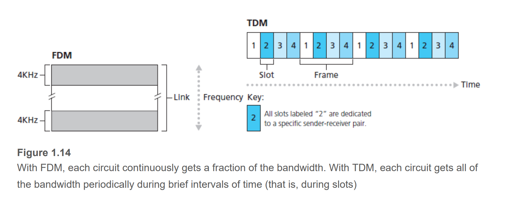
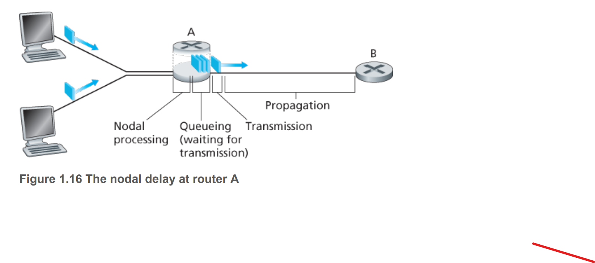
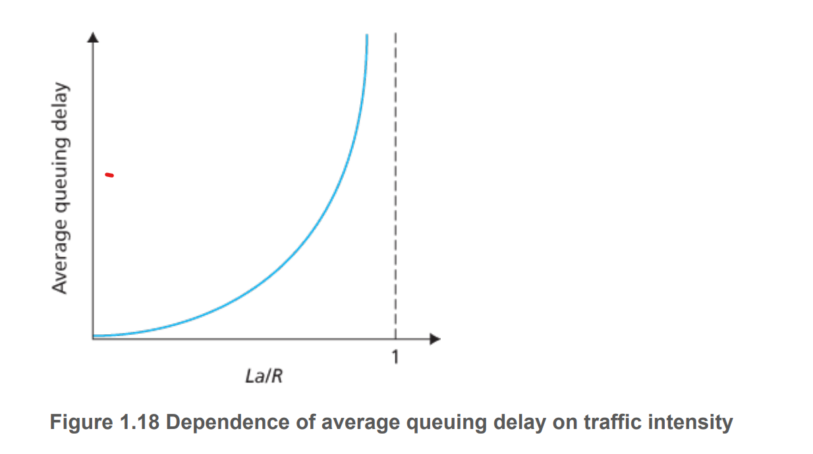

## What is the Internet

### Compositional Perspective 

- Is a computer network that connects computing devices 
- The devices are called `hosts` or `end systems`
- The systems are connected via `communication links` and `network switches`.
- `Communication links` - physical media - coaxial cable, copper wires, optical fibres, etc 
- Links transmit data at different `transmission rate` - in bits/second
- When one end system transfers data to another, the sending system `segments` the data and add `headers` to each segment.
- The resulting packages of information are called `packets`.
- `Packets` are sent through the network and reassembled at the destination `host`.
- `Packet switch` takes a packet from an incoming link and forward to an outgoing link.
- `Routers` and `link-layer switches` are two common types of packet switches.
- `Link-layer switches` are used in `access network`
- `Routers` are used in `network core`
- End systems access the internet via Internet Service Provides (ISP). 
- Each ISP is also a network of packet switches and communication links.
- The Internet is about connecting end systems together.
- Communication between components of the network is conducted under different `protocols`
- TCP and IP are the two most important. 
- Protocols are outlined in a set of agreed upon standards developed by the Internet Engineering Task Force called `requests for comments (RFC)`

### Functional Perspective 

- Internet is an infrastructure that provides services to applications.
- `Distributed applications` are applications involving multiple end systems that exchange data with each other. 
- Internet applications run on `hosts` and not the `packet switches` in `network core`.
- `Packet switches` facillitates data movement and do not handle applications. 
- `Hosts` attached to the Internet provide a `socket interface` - a set of rules that the sending program must follow so information can be delivered to target program. 
  
### Netwok protocol:

A `protocol` defines the format and order of messages exchanged between two or more communication entities, and the actions taken on the transmission and receipt of a message or other events. 

## Network Edge

### End Systems 

- Computers and end devices are `end systems` or `hosts`. 
- `Hosts` can be further classified into `client` and `server`. 
- `Client` is the `host` sending communication requests.
- `Server` provides a response for incoming requests. 

### Access networks 

- The network that physically connects an `end system` to the first `router` on a path from one end system to another end system. 
- Access network may be wired (DSL, Fiber-optic, Ethernet), wireless (Wifi, Cellular, Satellite) or a combination of both. 
- ISP typically owns access networks.

### Network core

- The network of packet switches and links that interconnect the `end systems`. 
- When data is transmitted over the internet, it is transmitted as a set of `packets` to be sent over communication links.
- Transmission happens at the `max rate` of the `communication link`. 
- Time to transmit a packet of size $L$ over a link with rate $R$ is $L/R$. 

#### Packet-switching store and forward transition 

- Packet switch must receive the entire packet before it can transmit the first bit to outgoing link. 
- This introduces a `store and forward delay`. 
- If there are $P$ packets each of size $L$ transmitted over $N$ links with rate $R$, then end to end delay is 
$$NL/R + P-1$$

#### Queuing delay and packet loss 

- Each `packet switch` has multiple links. 
- For each link there is an `output buffer` which stores packets to be sent into that link. 
- If a packet arrives at a link and the link is busy, it will be put to the queue.
- Hence there is a `queuing delay` as a packet must wait for all packets before it to be sent. 
- If the `output queue/buffer` is full, a newly arrived packet will be dropped, leading to `packet loss`. 

#### Forwarding table and routing protocols

- A router uses the `forwarding table` to determine which link to redirect incoming packets to. 
- The `fowarding table` is a key-value pair look up table that determines the outbound link from the packet's destination `IP address`. 

#### Circuit switching 

- Two approaches to moving data through a network of links and swwitches: `circuit switching` and `packet switching`. 
- In `circuit-switched` networks, resources needed along a path between `end systems` are reserved for the duration of communication session. The sender can send data to receiver at a **guaranteed** constant rate.  
- In `packet-switched` networks, the resources are used on demand and no reservation. If the network is congested, then packet will have to wait in buffer and suffer a delay. 

 #### Circuit switching - multiplexing 

 - Two alternatives - `frequency division multiplexing (FDM)` or `time-division multiplexing (TDM)`.
 - For `FDM` the link dedicates a frequency band to each connection for the duration of the connection. 
 - For `TDM`, time is divided into frames of fixed duration, and each frame is divided into a fixed number of time slots. The link dedicates one time slot in every frame for a connection: 

 - For `TDM`, the transmission rate of a circuit is the frame rate (number of slots per second) multipled bny the number of bits. - i.e. if 8000 frames per second, each time slot is 8 bits, then $L = 8000 \times 8 = 64,000 bps = 64 kbps$.
 - Circuit switching is **wasteful** during idle period but is **reliable**. 

#### Practical comparison between circuit switching and packet switching: 

- Packet-switched circuit can service more users, assuming that the chances of concurrent users exceeding the link bandwidth is low. 
- If there is only one user, circuit-switched network users can only use allocated resources which is a proportion of total bandwidth, while the user in packet-switched network can use all resources.  

#### Exercise 

- If a file of size $640$ Kb is sent from host A to B over a `TDM` circuit-switched network, with $24$ slots and link rate $1.536$ Mbps. Suppose that the duration for end to end connection set up is $500$ms, how long does it take to send the file: 
  - Effective transmission rate: $R = 1.536 \times 1000/24 = 64$ kbps
  - Time taken to send the file: $t = L/R = 640/64=10$ seconds.
  - Time taken with e2e connection delay: $t = 10 + 0.5 = 10.5$ seconds.  

- Given a 1 Mbps link shared between a number of users, each altenatubg between inactivity and usage at constant 100 kbps. If each user is active at 10% of the time, what is the number of users that the link can service for circuit-switched and packet-switched circuit? Assume that delay is acceptable if it happens for less than $0.01 \%$ of the time.  
  - For circuit switched, the link must be reserved, so the maximum number of supported users is: $1000/100=10$ users. 
  - For packet-switched circuit, let $X ~ B(n,p)$ be the random variable of number of active users. If the number of active user is less or equal to 10, there is essentially no queuing delay. Hence we need to find $n$ such that $P(X \leq 10) = 99.9\%$. $n=35$ gives $P(X\leq 10)=99.96\%$, which means the link can service 35 people in total, and that delay happens in less than $0.01 \%$.

## Delay, Loss and Throughput 

- Setting -  a packet is sent through router `A` to `B` as shown: 
- Processing delay - time required to examine header and determine where to direct packets. 
- Queuing delay - time spend waiting in the buffer of target outbound link. Depends on network traffic. 
- Transmission delay - time required to push all packet's bits into the link. $L/R$
- Propagation delay - once a bit is pushed to the link, it needs to propage to router `B`. Time required to propagate from the beginning of the link to router `B` is `propagation delay`. Propagation delay = $d/s$ where $d$ is distance between router `A` and router `B` and $s$ is the propagation speed of the link

**Note**: bandwidth $R$ affects transmission delay. Increasing a link bandwidth helps decreasing transmission delay. On the other hand, propagation speed $s$ which is a fraction of the speed of life dictates propagation delays. 

### Queuing delay and traffic density 

- Queuing delay varies from packet to packet depending on traffic condition. 
- Let $a$ be average incoming traffic - (packets/sec) with packets of size $L$ bits.
- Hence average bit arrival rate is $La$ (bits/sec).
- Ratio $La/R$ is `traffic intensity`.
  - If `traffic intensity` is greater than 1, rate of arrival is greater than rate at which bits can be transmitted -> Queue grows leading to queuing delay.
  - If `traffic intensity` is `<=1`, 
    - If packets arrive periodically -> empty queue and no delay
    - If packets arrive in burst -> there may be a queue. 
- `Traffic intensity` alone is not sufficient to characterise queuing delay, but gives a heuristic. 

### End-to-End delay:

Suppose that there are `N` links or `N-1` routers, that the traffic is uncongested w/o queuing delay, that processing delay is $d_{proc}$ at each router, transmission delay is $d_{trans}$ out of each router, and propagation delay on each link is $d_{proc}$. The end to end delay is therefore: 

$$d_{e2e}=N\times(d_{proc} + d_{trans} + d_{prop}) $$

Where 
- $d_{trans} = L/R$
- $d_{prop} = d/s$

## Throughput 

Throughput is defined as the minimum bandwidth of all links along the path from end to end. 