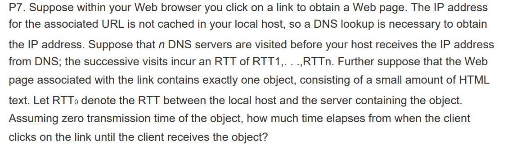
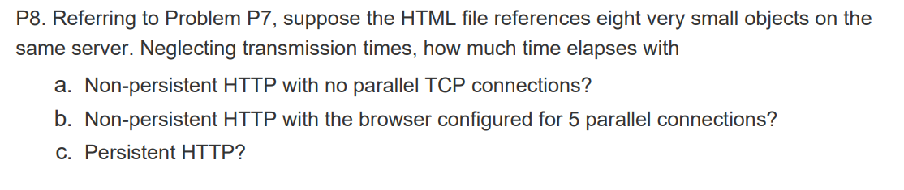
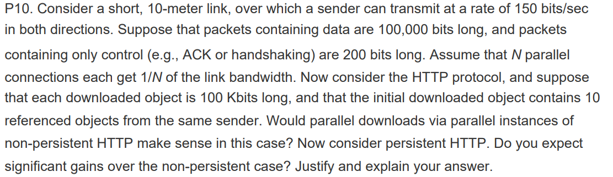
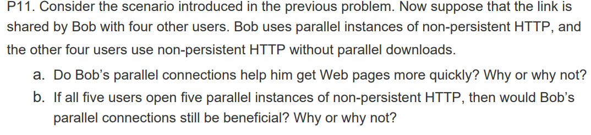
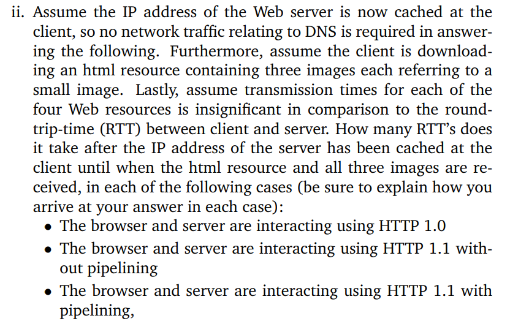

# DNS 

## 1. How can iterated DNS queries improve the overall performance?

- Iterated request can improve overall performance by offloading the processing of requests from root and TLD servers to local servers. In recursive queries, root servers can be tied up ensuring the completion of numerous requests, which can results in a substantial decrease in performance. Iterated requests move that burden to local servers, and distributed the load more evenly throughout the Internet. With less work at the root servers, they can perform much faster.

- Reduce chances of DNS poisoning and other attacks.  

## 2. Explain the benefits of having a distributed DNS instead of centralised: 

- Large DNS traffic would cause great burden on one single server
- Huge DNS record makes it difficult to maintain (run backup and restore)
- Reduce risk of failure as having a single point of failure would mean the Internet would get shutdown if the server is shutdown. 
- Proximity: no single DNS server is close to all edges -> huge propagation delay. 

## 3. What are the different DNS servers: 

- Root - hold top level domain DNS server entries 
- TLD - hold authoritative DNS server entries 
- authoritative - hold host entries. 
- Local - for caching purposes 

## 4. Describe the DNS query lookup process: 

- Host contacts local DNS server for a domain name.
- Local DNS server looks up. If the entry exists, it returns to the querying host, otherwise forwards the entry to a root DNS server.
- Root DNS server responses with the IP address for TLD server, which is contacted by the local DNS. 
- TLD server responses with the IP address for the authoritative DNS server, which is contacted by the local DNS server.
- authoritative DNS server responses with the IP address for the given hostname, which is then returned to the querying host from the local DNS.

## 5. Why does DNS use UDP? 

- Connectionless, hence quicker, there is no 3 way handshake and other baggages associated with flow and congestion control. 
- UDP can support more clients at the same time due to the lack of connection state (less OS overhead). 
- DNS requests are small and fit within an UDP segment. 

## 6. Describe a DNS record

(Name, Value, Type, TTL)

- Type A: value is ip address of hostname 
- Type NS: value is hostname of an authoritative DNS server.
- Type CNAME: value is canonical hostname 
- Type MX: value is canonical mail server

## 7. Describe what is stored when a server is an authoritative server for a hostname and when it is not: 

- If an authoritative server: store type A entry for the hostname.
- If not an authoritative server: 
  - store type NS entry for the domain that includes the hostname
  - store type A entry for the value of the NS entry 

## 8. Describe the different DNS vulnerability attacks: 

- DDOS the root DNS server 
- DDOS the top level domain server 
- Intercept queries from hosts and returns bogust replies. 
- DNS poisoning - send bogus replies to DNS server. 

# P2P file transfer 

## 1. Derive the maximum time for distributing a file over a network for client server and peer to peer: 

Let $u_s$ be the server upload speed, $u_i$ be the peer's upload speed, $d_i$ be the peer's download speed, $F$ is file size, and $N$ be the number of files then:

- For a client server architecture, the server needs to transmit $NF$ bits over the upload link and the peers need to download over their respective link: 
  - Upload: $NF/u_s$
  - Download: $F/d_i$
Let $d_{min}$ be the minimum download speed of the N peers, then the total time is: 
$$T_{cs} = \max(\frac{NF}{u_s}, \frac{F}{d_{min}})$$

- For peer to peer, the server needs to distribute the file to the first peer, the file needs to be downloaded by each peer, and all files will be uploaded by a peer whenever it receives the file: 
  - Upload a single file: $F/u_s$
  - Download: $F/d_{min}$
  - All upload: $NF/(u_s + \sum u_i)$
Hence total time: 
$$T_{p2p}\geq \max(\frac{F}{u_s}, \frac{F}{d_{min}}, \frac{NF}{u_s + \sum u_i})$$

## 2. Explain the file transfer process in BitTorrent: 

- When a new peer enters a pool, the tracker assigns a group of neighbours who will be exchanging chunks with the peers. 
- Each chunk is aware of what chunks the neighbors have, and hence can exchange chunks between themselves via rarest first policy: find among the peers the chunk rarest among the peers and distribute the chunk.
- Peers are matched via their exchange rate - i.e. only responds to neighbours responding with the highest exchange rate.  
- Every 10s, the top neighbouring peers are unchoked - that the peer recalculate the rate and reset group of top neighbours.
- Every 30s, the peer picks a random neighbour and send chunk - optimistically unchoked. 

## 3. What is meant by tit-for-tat, unchoking and optimistically unchoking

- Tit-for-tat: a peer only sends chunks to neighbours who supply to it at comparable transfer rate. It maintains a group of close neighbours among its neighbours that it exchange chunks with. 
- Unchoking: every 10s, the peer recalculates the rate and possibly modify the set of top neighbours. 
- Optimistically unchoking: every 30s, the peer choose a random neigbour to send chunk too. 

## 4. If a new peer joins BitTorrent without any chunk, how will it get its first chunk: 

- Via optimistic unchoking - i.e every 30s, a peer chooses a random peer from its neighbours to send chunk to. 

## 5. If a peer is a free rider, can he get a complete copy of the file? 

Yes it is possible if the transfering peers remain in the pool for long enough. The free rider can always receive new chunks via optimistic unchoking. 

# HTTP and Delay

## 1. HTTP mechanism to reduce delay 

- Persistent connections: TCP connection can be used to transfer multiple objects without wasting 1 RTT for connection setup. 
- Pipelining: client can request multiple objects asynchronously hence reduce waiting time.
- Caching or Proxy Server: requests may be served by a local server at close proximity with higher bandwidth and hence reducing delays.

## 2. Different sources of delay 

- Processing delay - incur at router when processing header information to perform network services. 
- Queuing delay - when a packet need to wait in a buffer before getting send due to other sending processes using the same channel. 
- Transmission delay - time delay incurred to push the first bit onto the link 
- Propagation delay - time delay incurred to traverse the physical link to a remote host. 

## 3. How to determine transmission delay: 

Assume tranmission of $P$ packets of size $L$ over $N$ links at rate $R$: 

$$ \frac{L}{R}(N+P-1)$$

## 4. How to determine propagation delay: 

Let d be the length between the links, and s be the speed over the link: 
$$d/s$$

## 5. How to reduce transmission delay: 

Reduce transmission size and/or increase bandwidth.

## 6. What is the difference between network architecture and application architecture: 

Network architecture is the organisation of the communication processes into layers. Application architectures is designed by application developer and dictates the structure of the application.

## 7. For a communication session between a pair of processes, which process is the client and which is the server?

Process that initiates connection is client and the other is the server. 

## 8. What information is used by a process running on one host to identify a process running on another host?

Destination IP address and destination port number. 

## 9. Why do HTTP run on top of TCP rather than UDP? 

The application requires all data sent to be received without gap and in correct order. 

## 10. If the TCP server were to support n simultaneous connections, each from a different client host, how many sockets would the TCP server need?

Need n + 1. 1 for listening to incoming connection request, n for actual connections. 

## 11. Consider an HTTP client that wants to retrieve a Web document at a given URL. The IP address of the HTTP server is initially unknown. What transport and application-layer protocols besides HTTP are needed in this scenario?

Need DNS protocol (application layer) sent in a UDP packet (network layer). HTTP uses TCP protocol in network layer.

## 12. Answer this problem 

Each DNS lookup is over a UDP hence total time for the lookup is $\sum_{1}^n RTT_i$. HTTP request is over TCP connection hence total time for object request is: $2RTT_0$. Total delay: $2RTT_0 + \sum_{1}^{N}RTT_i$

## 13. Answer this problem

Time taken is the time to load the web page and the additional 8 objects 

- Non persistent HTTP with no parallel TCP connections - 8 separate connections for each object, hence 8 two $RTT_0$:
$$\sum_{1}^N RTT_i + 2RTT_0 + 8*2RTT_0 $$
- Non persistent HTTP with 5 parallel TCP connections: 
$$\sum_{1}^N RTT_i + 2RTT_0 + 2*2RTT_0 $$
- Persistent HTTP with pipelining - getting all objects in 1 $RTT_0$
$$\sum_{1}^N RTT_i + 2RTT_0 + RTT_0$$
- Persistent HTTP without pipelining - time to establish connection then 1 RTT for each requested object: 
$$\sum_{1}^N RTT_i + 2RTT_0 + 8*RTT_0$$

## 14. Answer this

For both scenarios, what happen is: 
- The SYN bit packet is sent to server 
- Server sents SYNACK packet to client 
- Client sends a request for web page 
- Server transmits request web page object
- The client then requests additional 10 objects either via persistent connection or via parallel connections.

Common time: 

$$3\frac{200}{150}+\frac{100,000}{150}=670 \quad s$$

Since transmission is over 10m, the propagation delay is negligible and is dropped from calculation. 

With 10 parallel connections - each connection requires two round trips of 3 SYN/ACK/request packets exchange and 1 data transfer: 

$$670 + (3\frac{200}{15} + \frac{100000}{15})=7377 \quad s$$

With 1 persistent connections, each object request requires 1 round trip of a request packet and 1 data transfer packet: 
$$670 + 10(\frac{200}{150} + \frac{100000}{150})=7351 \quad s$$

Hence no significant difference

## 15 Answer this: 

Yes because Bob has more connections, he can get higher share of the bandwidth. 
Yes still needs parallel otherwise he will get less bandwidth than other users. 

## 16 Answer this: 

The client needs to set up 3 way TCP handshake with the server to get the html web object, which costs 2 RTTs.

- Using HTTP 1.0 means separate connections are used for each request: 
Hence this uses 3 requests for 3 objects on top of the original setup, each costing 2 RTT. Hence in total 2 + 3 x 2 = 8RTT 

- Use HTTP1.1 without pipelining - by default HTTP1.1 uses persistent connections. Hence after the original TCP setup, each object request costs 1RTT. Hence in total 2 + 3 = 5 RTT
  
- Use HTTP1.1 with pipelining: pipelining allows the client to request 3 objects in 1 RTT, hence in total: 2 + 1 = 3 RTT