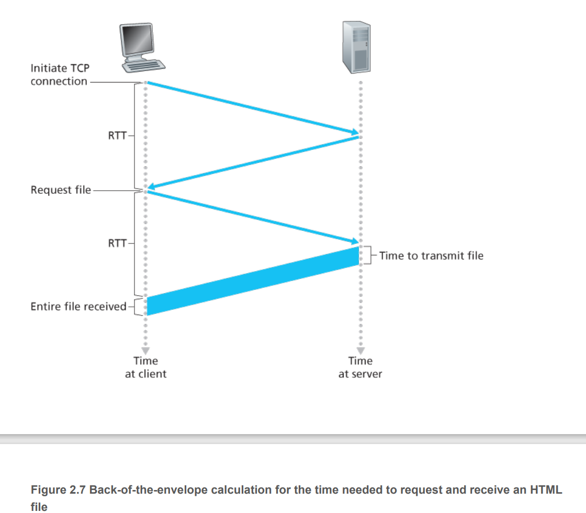
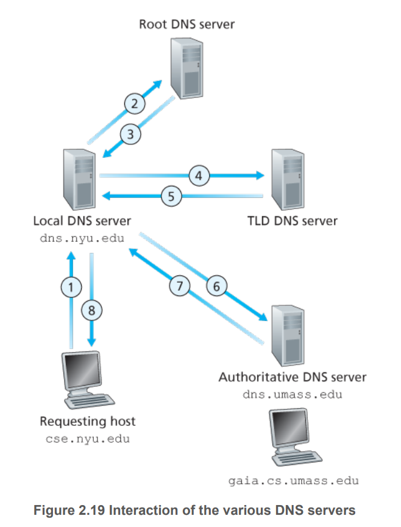
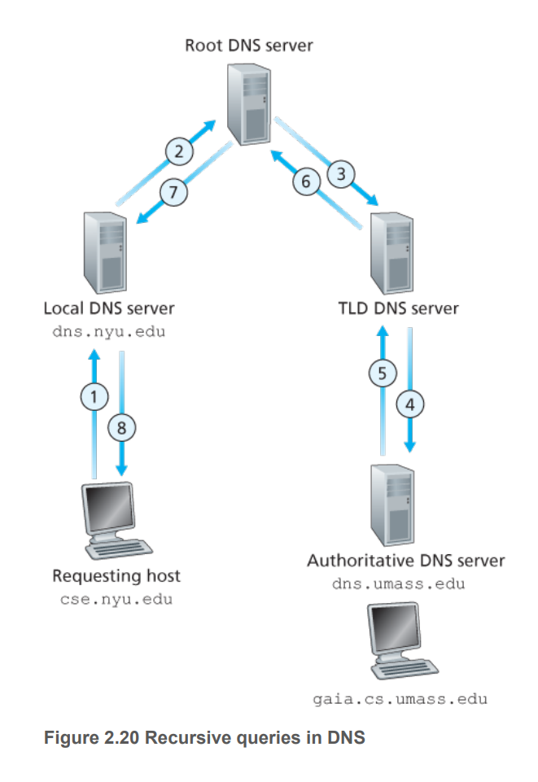
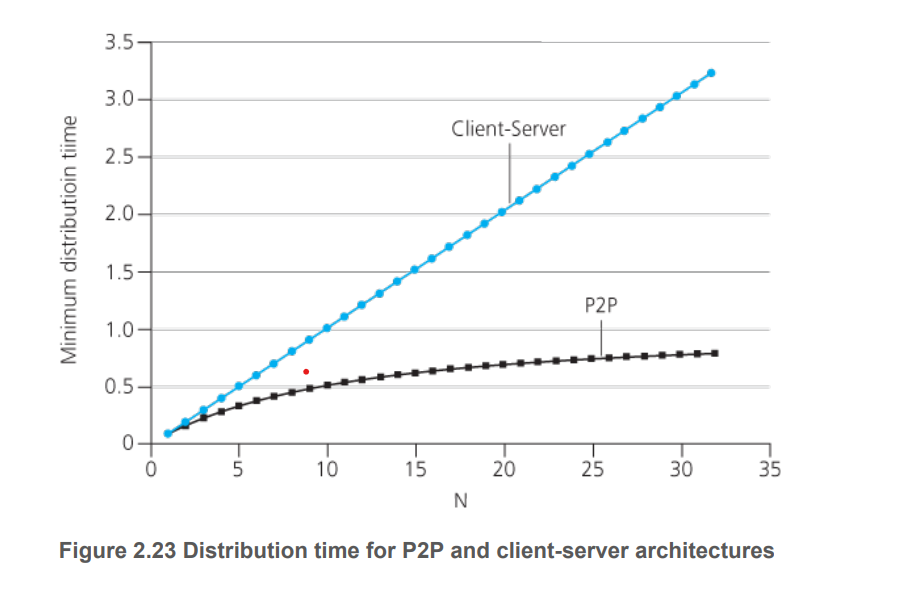

# Network Application Architecture 

- `Application architecture` is different from `network architecture` and affects how the applications are run over the end systems. 
  - `Client Server`: there is a `server` which is an always on host with fixed `IP address`, serving responses to requests sent by a `client`. In `client-server` architectures, clients do not directly interract with one another. Some examples: web, email, FTP, etc. If there are many requests that cannot be handled by a single server, a `data centre` is used to provide a virtual server. 
  - `Peer 2 Peer` - communications are facillitated directly between two end systems. THey are `self-scaling` and cost effective. 
  
### Communication Processes 

- Communications between two end systems are conducted through processes on each end system, via exchanging messages across the network. 
- `Client Process` is the process that initiates communication.
- `Server Process` is the process that waits for contact to initiate a communication session. 
- Processes communicate through an interface called `socket`, which is an interface between the application layer and the transport layer within a host. A developer has little control over the transport layer, aside from choosing transport protocol and some parameters. 
- Processes are identified using `IP address` and `port number`.
- The `IP address` uniquely identifies the `receiving host`, and the `port number` helps to identify the `receiving process` residing on the host. 

### Transport Services and Protocol (lower level)
Desired data services: 
- `Reliable Data Transfer` - guaranteed data delivery - i.e. data sent from a sending process must be fully and correctly delivered to the receving process. 
- `Throughput` - guaranteed rate of data delivery. 
- `Timing` - guaranteed maximum delay time. 
- `Security` - guaranteed confidentiality in data delivery service. 

### TCP: 

- `Connection-oriented` service - a TCP session is created after a 3 way handshake. Both processes in a TCP session can send and receive data using the connection. When finished, the connection is torn down. 
- `Reliable Data Transfer` service - data sent over TCP is without error and in proper order. 
- Also has congestion control 

### UDP 

- `Connectionless` service - no connection is set up for communication. 
- `Unreliable Data Transfer` service - no guarantee for data to be delivered. 

# Application Protocol 

## HTTP Protocol 

- Designed for communications in the `client-server` architecture. 
- `Client`  and `server` processes communicate via exchanging `HTTP` messages.
- Uses `TCP` as the underlying transport protocol. 
  - The HTTP client first initiates a TCP connection with the server. 
  - Once established, the connection allows for communication through client and server sockets. 
- `HTTP` is a stateless protocol because it maintains no information about the clients. 
- A `Web` server is always on with a fixed IP address, and it services requests from many different browsers. 

### HTTP with Persistent and Non-Persistent connections 

- Non-persistent: the connection is closed right after the server sends an object. 
- Persistent: the connect persists and can be used to send other objects. 
- With non-persistent, a new connection must be established and maintained for each requested object, which costs a minimum delay of 2 RTTs (+ transmission time) for connection establishment + object transfer. Additionally, each connection requires a TCP buffer to be allocated, which may place a burden on the server (OS overhead). 
- Persistent connection is a feature of HTTP 1.1. Objects sent over persistent connection can be made back to back without waiting for replies to pending requests (pipelining). 
- Persistent without pipelining allows the client to make request only after the previous response has been received. This costs 1 RTT for each requested object.
- Persistent with piplining allows the client to make requests as soon as it encountered a referenced object, which means it can receive all reference objects in as little as 1 RTT. 
- Note that pipelining over HTTP1.1 suffers from head of line blocking, in which a failed response to a request at the start of the pipeline may hold up other responses. This is addressed in HTTP2

### Calculating the time to send over an object via HTTP 

- The client first sends a small TCP segment to the server, which then sends back a small TCP segment to the client. (1 RTT)
- The client receives the small TCP segment from the server and send the request together with the third part of the handshake. (TCP connection is established)
- The server receives the request then transmit the object back to the client. (1 RTT + transmission delay)

### Cookies 

- Even though HTTP is stateless, client process can still be identified via cookies. 
- Suppose the backend server has a user's information, it can send this id information back to the user's computer to identify the user in future requests.
- For cookies to work, it requires:
  - A cookie header in HTTP request 
  - A cookie header in HTTP response 
  - Cookie data to be store on the user's computer 
  - Data from the backend server to uniquely id the user based on cookie information. 

### Web Caching/Proxy Server 

- A `web cache` is a network entity that satisfies HTTP requests on behalf of an origin Web server. 
- When a request is made from a client to a target server, the web cache forward the request to the target serve and cache the response if no response for that request is found in storage or if the cached response is no longer fresh. Otherwise it will service the request with the cached response. 
- Web caching helps significantly reduce response time, especially if the bottleneck bandwidth between the client and the origin server is much less than the bottleneck bandwidth between the web cache server and the client. (Web cache is typically owned by the ISP and has closer proximity). 

# DNS 

## What is DNS?
- Internet hosts can be identified by `hostnames` which are mnemonic and human-friendly, or `IP addresses` which are used by routers. 
- `DNS` is a distributed databased implemented in a hierrachy of `DNS server`.
- `DNS` is also an application layer protocol that allows hosts to query the distributed database. 
- `DNS` query and reply messages are within UDP datagrams to port 53. 

## DNS services

- `DNS` is used by other application protocols like `HTTP` or `STMP` to translate user-supplied hostnames to IP addresses.
- `DNS` also offer services such as:
  - `Host aliasing` - a host with complicated hostname can have alias names. 
  - `Mail server aliasing`: email address alias name.
  - `Load distribution`: perform load distribution among replicated servers i.e web servers such as `cnn.com` are replicated over multiple servers, and a query made to `cnn.com` may be distributed to one of the servers with spare capacity. Achieves by `DNS` having a set of `IP addresses` for the hostname, which it rotates the order based on load.  

## Why distributed instead of centralised

DNS server is not centralised because it lacks `scalability`:
  - A single point of failure: crashing one server means crashing the whole Internet.
  - Traffic Volume: large volume from all Internet users makes it impractical for a single server to service. 
  - Proximity: significant delay
  - Maintenance: a single server would have to keep records for all hosts, which makes it difficult to update and maintain. 
  
## General DNS query process: 

- User provides hostname to DNS client application
- DNS client application looks up hostname through DNS server.
- DNS client application provides corresponding IP address 
- User application sets up a TCP connection to IP address at port 80 under HTTP protocol.

**Note**: the process described here is very simplistic. DNS servers are arranged in hierrachical order to reduce the response time. 

## Distributed DNS architecture 

- No single DNS server has all the mappings for all hosts. Mapping are distributed across the DNS servers. 
- There are three classes of DNS servers: 
  - `Root` - Provides IP addresses for Top level domain servers.  
  - `Top level domain` - domain `com` or `net`. Provides IP addresses for Authoritative servers.
  - `Authoritative` - for specific organisation hosts like `amazon.com`. Provides IP address for hostname.
- There is also a `local DNS server` maintained by ISPs. When a host makes a DNS query, the query is sent to the local DNS server which acts as a proxy, forwarding the query into the DNS hierarchy. 

### Example: 

- A host from `cse.nyu.edu` wants to query `gaia.cs.umass.edu`.
- It contacts `local` DNS server for `cse.nyu.edu` called `dns.nyu.edu`, querying the hostname `gaia.cs.umass.edu`. 
- `Local` DNS server forwards the query to a `root` DNS server.
- `Root` DNS server returns to `local` DNS server with IP addresses of `TLD` DNS servers for `.edu`.
- `Local` DNS server then forward the query to one the the `TDN` DNS servers. 
- `TLD` DNS server returns the IP address of the `authoritative` DNS server for `gaia.cs.umass.edu`, which is `dns.umass.edu`.
- `Local` DNS server then pings the `authoritative` DNS server for the hostname, which gives it the IP address.
- The `local` DNS server finally gets back to the querying host with the response containing the target IP address. 

The interraction is described in the following figure: 

## Recursive and Iterative Queries

- When a DNS client makes a DNS query request from a DNS server, and the server manages subsequent queries on the client's behalf, this behaviour is `recursive`. - i.e. when a client makes a query to a `local` DNS server, the `local` DNS server recursively query the DNS hierarchy to get the target IP address and get back to the client.
- When a DNS client makes a DNS query request from a DNS server and the server responds with the next DNS server it should direct the query to in the DNS hierarchy, this process is `iterative`.  
- Queries can be either `recursive` or `iterative`.
- Typically, queries from a client to `local` DNS server are recursive while subsequent queries are `iterative`. 
- `Recursive` query can place heavy burden on the DNS server in charge, especially at higher level in the hierarchy - i.e. the root DNS in Figure 2.20 if there are a lot of DNS queries. 

## DNS Caching 

- Reduces the number of queries on the Internet.
- Each time a local DNS server receives a reply from some DNS server, it can cache any information contained in the query -i.e. the hostname, IP address mapping, or the mapping to one of the TLP servers. 
- Because hosts and mappings between hostnames and IP addresses are not permanent, the cached information may get discarded after sometimes. 

## DNS Records

A resource record is a four-tuple that contains `(Name, Value, Type, TTL)`:

- If `Type=A`, `Name` is hostname and `Value` is IP address.
- If `Type=NS` then `Name` is a domain -i.e. `foo.com`, and `Value` is the hostname of an authoritative DNS server.
- If `Type=CNAME`, then `Name` is a provide alias hostname, and `Value` is the canonical hostname. 
- If `Type=MX`, then `Name` is the provided alias mailserver name, and `Value` is the canonical mailserver name.

Applications:
- If a DNS server is authoritative for a hostname, then the DNS server will contain a Type A record for that hostname. Note a local DNS server may contain a cached Type A response. 
- If a DNS server is not authoritative for a hostname, then it contains Type NS record for the domain that has the hostname, AND Type A record for the DNS server in the Value field of the Type A record. 

## Inserting new DNS records: 

- Register new domain name at a `registrar` - a commercial entity that verifies the uniqueness of a domain name. 
- Provides the registrar with the domain name and IP address of the primary and secondary authoritative DNS servers. 
- The registrar then make Type NS and Type A records into the TLD servers. 

## DNS Vulnerability: 

- DDos bandwidth flooding attack at root: no impact on user's experience due to caching which direct traffic away from DNS root servers. Packet filter; ignore ping messages directed to root DNS servers.
- DDos attack at TLD servers: partially mitigated by caching.
- Intercept queries from hosts and return bogus replies. 
- DNS poisoning: the attacker sends a bogus reply to a DNS server, tricking the server into accepting bogus records into its cache. The cache could be used to redirect users to attackers' website. 
- DNS is robust against attack: no known successful attack to date. 
  
- # P2P file distribution 

- `Client server` architecture requires the server to always be up. 
- `P2P` architecture allows for intermittently connected hosts to communicate directy. 
- Performance comparison:
  - Let $u_s$ be the upload speed of server's link, $u_i$ be the upload speed of each peer, $d_i$ be the download speed of each peer, $F$ file size, $N$ number of peers:
  - Under client server, server distribute a file size $F$ to $N$ clients hence time to upload to the link of each peer is $NF/u_s$. Each peer then download the file from access link at cost $F/d_i$. Hence the time taken to distribute $F$ to $N$ peers for client server is:  
  - $t_{cs} = \min\left(NF/u_s, F/d_{\min} \right)$
  - For p2p, time taken to upload to 1 peer: $N/u_s$. Time for a peer to download a file: $F/d_{\min}$/ Time for the whole network to redistribute the file: $NF/(\sum_{u_i} + u_s)$
  - $t_{p2p} = \min(F/u_s, F/d_{\min}m,NF/(\sum_{u_i} + u_s))$
  - Client server performance increases linearly with number of peers, while p2p is a lot better. 

## Bit Torrent Protocol

- Collection of all peers - `torrent`
- Peers in a torrent download equal-size`chunks` of the file from one another.
- When a peer first joins a `torrent`, it has no `chunk`, but accumulates them over time.
- While downloading, a peer also redistributes its chunks to other peers. 
- Once finished, it may leave the torrent or remain and continue to upload to other peers. 
- Any peer may leave at any time with only a subset of chunks and later rejoin torrent. 
- Each torrent has an infrastructure node called a `tracker`
- When a peer joins a torrent, it registers with the tracker and periodically informs that it is still in the torrent. 
- The tracker then randomly selects a subset of peers and the the subset to the new peer, which it then establishes `TCP` connections with. 
- At any given time, a peer has a subset of chunks, and different peers may have different subsets. 
- A peer may request a chunk periodically from each of its neighbour. The technique to determine which chunk is `rarest first`: find among the chunks it doesn't posses, the chunks that are the rarest among the neighbours and then request the rarest chunk first. With this, the rarest chunk get redistributed to all neighbours. 
- To determine which peer to response to, a peer prioritises neighbours that supply data at the highest rate. Every 10 seconds, the rate is recalcualted - `unchoked`. Every 30 seconds, a random neighbour is selected to have a chunk sent to - `optimistically unchoked`. 
- This allows peers with compatible rate to find each other. The random neigbour selection allows new peers to get chunks so that they have something to trade. 
- Other neighbors are `choked` that is they do not receive anything. 
