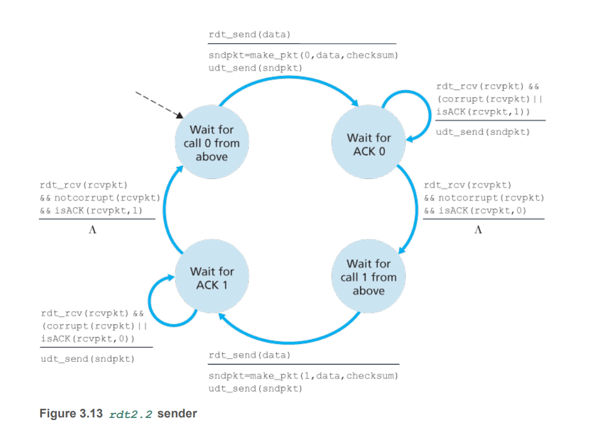
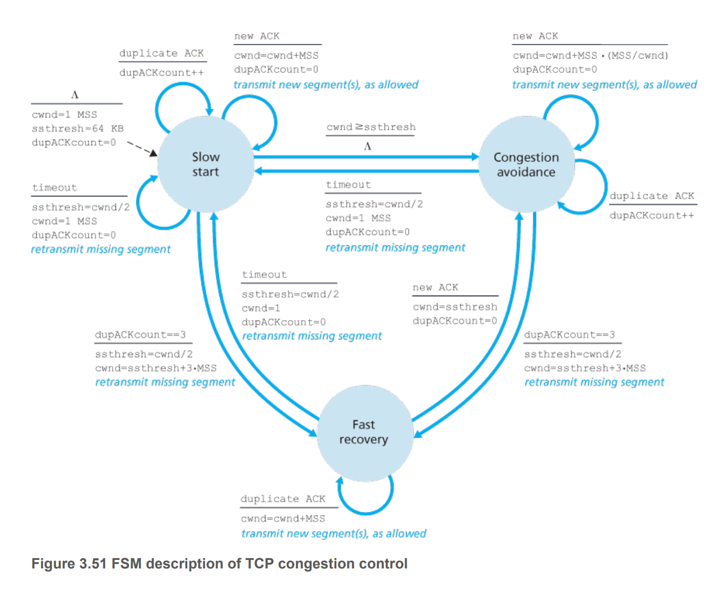

# Transport Layer Services:

- Provide `logical communication` between application process running on different hosts. From the application's perspective, the processes are directly connected even though they are not. 
- Transport layer protocols are implemented in the end systems and not in network routers. 
- Convert application message into transport layer segments.  
- Transport layer provides logical communication between `processes` on different hosts.
- Network layer provides logical communicat ion between `hosts`. 

## Services offered by transport layer:

- `Transport layer multiplexing/demultiplexing`: process to process delivery
- `Error checking` - integrity checking 
- `Best Effort Delivery`: offered by UDP. Packet loss or packets arriving out of order may be present. 
- `Reliable Data Transfer`: offered by TCP. Data will be transferred without fail and in the correct order (no corruption).
- `Congestion Control`: prevents any one TCP connection from hogging all resources - regulate rate of data sent into the network. 
- `Flow Control`: ensure sender does not overflow receiving buffer of receiver in  TCP connection.
  
# Multiplexing and Demultiplexing 

- `Demultiplexing`: deliver segments to the correct socket of the receiving processes. 
- `Multiplexing`: gather data chunks at the source host from different sockets, prepend headers to create segment, which is later used for demultiplexing, and passing segments to the network layer. 
- They are relevant whenever a single protocol at one layer is used by multiple protocols at the next higher layer.
- `Multiplexing` requires that sockets have unique ID, and that each segment has a field indicating the target socket ID. 
- `Demultiplexing` requires the socket ID of the target process so that it could deliver the segment to that socket. 

## For UDP

- UDP socket is fully identified by (`dest IP addr`, `dest port number`). 
  - UDP uses `src port number` in case it wants to send something back to the sending host. 

## For TCP 
- For TCP, since a connection is establish for communication between two processes on two different hosts, each socket is bound to a specific connection and requires a four-tuple (`src IP`, `src port`, `dst IP`, `dst port`) to uniquely identify it.
  - TCP has a welcoming socket that waits for connection establishment requests.
  - Once the server receives a request for TCP connection from the welcoming socket, it **creates a new socket** to handle the requested connection, identified by the four-tuple. 

# Reliable Data Transfer 

- In reliable data transfer service, the application expects the transport medium to be reliable - i.e. packets delivered in the correct order, with no bit corruption.
- Problem arises when the underlying transport layer is unreliable. The following section deals with components of reliable data transfer, with the interfaces as shown: 


## RDT1.0 - perfectly reliable channel 

Assume there is no bit corruption and packets arrive in order . 


The sending side: 
- Accepts data from the layer above (application layer in this case), 
- Makes a packet from the data 
- Sends the data to unreliable data transport layer (`udt_send`).

The receiving side: 
- Receives a packet from the layer below (network layer in this case), 
- Extracts data from packet
- Passes the data to the upper layer. 

## RDT2.0 - bit error

Assume bits in a packet may be corrupted, but the packets arrive in order.

Relies on retransmission protocol known as ARQ (Automatic Repeat ReQuest) protocols, which use `positive ACK` and `negative ACK`. There are 3 components required for ARQ:

- `Error Detection`.
- `Receiver feedback`: feedback must be provided for the sender to know. 
- `Retransmission`. 


The sending side: 
- Two states
  - Waiting for a call from application layer 
  - Waiting for an ACK from receiver
- When called from above:
  - Make a packet with a checksum header for error detection. 
  - Send the packet 
- After sending: 
  - In a state of waiting for acknowledgement.
  - If a negative acknowledgement is received from layer below:
    - Resend the packet and stay in the same state.
  - If a positive acknowledgement is receive:
    - Go back to idle state.

The receiver side:
- If receives a corrupted message:
  - Send negative acknowledgement 
- If receives a non-corrupted message:
  - Send positive acknowledgement to sender 
  - Extract data from packet 
  - Deliver the message to layer above 

Issue: 
- Acknowledgement message may be corrupted.
- Use checksum in acknowledgement packet for sender to determine whether ACK message is corrupted.
- Upon receiving corrupted packet, the sender resends previous message. This is rdt 2.1.

## RDT2.1 - Sequence Number 

A one bit sequence number is sufficient.
- The sequence number is included in the packet sent by sender.  
- If a sender is resending a previously transmitted packet, the sequence number is the same as the one last received, and likewise. 
- Since RDT2.1 assumes channel does not lose data, the acknowledgement packets do not need to have sequence number of packet they are acknowledging. 
- The ACK is w.r.t the most recently transmitted packet. 


## RDT2.2 - Only positive Acknowledgement 




If instead of sending negative acknowledgement, the receiver now sends acknowledgement for the last correctly received packet. The sender now needs to include sequence number in the acknowledgement packet. 

## RDT3.0 - The channel can now lose packets

The packet loss detection mechanism is with timeout. If the sender does not receive postive acknowledgement for a packet of a given sequence order within a time window, it will resend the packet to sender. 


## Pipelined RDT 

RDT3.0 is a stop-and-wait protocol. Hence could be improved with pipelining. With pipelining, the range of sequence number must increase; the sender and receiver may have to buffer more than one packet:
- Sender buffers transmitted packets that have not been acknowledged. 
- Receiver buffers correctly received packets. 
- Sequence number range depends on specific protocol - GBN or SR.

## GBN 

Sender is allowed to transmit multiple packets without waiting for an acknowledgement, up to $N$ of unacknowledged packets in the pipeline. 


- `base`: seqnum of oldest ACKed packet.
- `nextseqnum`: seqnum of next packet to be sent. 
- [0, `base`-1] : seqnum of packets already transmitted and ACKed.
- [`base`, `nextseqnum`-1] : seqnum of packets transmitted but not ACKed
- [`nextseqnum`, `base+N-1`]: untransmitted packets.  
- Packets with sequence number greater than `base + N-1` cannot be used until unACKed packet has been acknowledged. 
- Limit the number of packets in sliding window to `N` for congestion control. 


### Properties of GBN 

- When timeouts, the sender resends all buffered packets that were transmitted but have not been ACKed. 
- The ACK packet sent from receiver cannot have `seqnum` higher than `base`, hence if sender receives an ACK packet, the ACK must be for either 
  - A correctly received packet (`seqnum` = `base`)
  - An out-of-order or corrupted packet (`seqnum`=`base`-1)
- This is known as `cumulative acknowledgement`: when the ACK `seqnum` is `n`, all packets with `seqnum` up to `n` must have already been ACKed. 
- Sender uses a single clock for timing, and timeout event happends w.r.t to the packet at `base` index. 
- Receiver discards out of order packets. 
- When receiving out of order packet or corrupted packet, the receiver will send an ACK packet with seqnum of the last correctly received packet. 
- Sender needs to have a buffer for unACKed packets, but receiver does not need to have a buffer. Only need to store a variable for expected seqnum. 

## SR

SR is designed to fix an issue with GBN. If GBN uses a long buffer, it will resend all packets in buffer even if only one packet with incorrectly received. SR only sends back necessary packets. It requires receiver to individually acknowedge correctly received packets. 


- SR receiver will acknowledge a correctly received packet even if it is out of order. 
- If a packet with seqnum within the receiver's window is correctly received, the receiver sends corresponding ACK and buffers the packet.
- If the seqnum of the correctly received packet is exactly the receiver's base, moves the base forward up to the seqnum not yet correctly received, and batch delivers all packets correctly received up to base. 
- If a previously ACKed packet is received, the receiver ACKs that packet. 
- For sender, each packet has its own timer which triggers a retranmission if an ACK packet with a matching seqnum is not received before times out. 
- Each packet in window has a status of whether it has been ACKed or not.
- If an ACK is for a packet at send_base, send_base is moved forward until the first unACKed packet. 
- If the window moves and there are now untransmitted packets within the window, those packets are sent. 

### Properties of SR

- Receiver needs to ACK packets below the current base. 
- For example, in fig 3.23, if the receiver doesn't acknowledge `send_base`, the sender will not be able to move forward. 
- Sender and receiver do not have identical views of what has been received correctly i.e. the window will not always conincide. 
- SR window size must be less than or equal to half the size of sequence number space for SR protocol, otherwise there will be confusions like Figure 3.27


## Summary of technologies responsible for RDT: 

- Checksum - error detection 
- Acknowledgement - to show that receiver has received a packet correctly
- Sequence number - for identifying packet that is correctly received/incorrectly received/loss. 
- Timeout - to address packet loss. 
- Buffer and window - for pipelining, allowing for continuous flow of packets and higher link utilisation. 

# Congestion Control 

## Consequences of congestion 

- The rate at which a host can send data to the network (`offer rate`) is capped by bandwidth that is shared with other hosts. 
- When `offer rate` is high, traffic intensity approaches 1 and `queuing delay` and `packet loss` due to dropping happens.
- When packet loss happen, the host will need to `retransmitted` packet, which `reduces` the `bandwidth` at which it can send new packet. 
- With premature timeout, the host may resend a packet before it exit the queue at router, causing `duplicates` to be sent to receiver -> wasteful.
- When connection is shared and `packet drop` happens, `transmittion` capacity used at the `upstream links` to deliver the drop packet to the point of dropping is `wasted`. 

## Approaches

- `End to End`: the network layer provides no support. End systems must handle congestion by itself. Used by TCP. 
- `Network Assisted`: router provides explicit feedback regarding congestion state. Optional for IP protocol. 

# UDP Protocol

- No frills, aside from `Multiplexing/Demultiplexing` service and `Error Checking`, it adds nothing on top of the IP Protocol. 
- UDP is connectionless as there is no connection to be setup. 
- UDP is preferred over TCP for being able to: 
  - Control over what is sent and when: there is no congestion control so an UDP segment can be sent as soon as it is made.
  - No connection establishment: no 1 RTT delay for making a request due to connection setup.
  - No connection state: TCP has a buffer for send and receive, sequence and acknowledgement numbers and congestion control parameters -> more OS overhead and thus a server using UDP protocol can service more clients. 
  - Small packet header overhead: TCP - 20 bytes of header, UDP - 8 bytes of header. 
- E.g. network management application prefers UDP because it is often used when the network is in a stressed state, which would not work well with TCP. 
- DNS also uses UDP for minimal delay to query. 
- Real time streaming also prefers UDP as it can tolerate packet loss and prefers minimal delay (connection setup and TCP congestion control).
- UDP can implement reliable data transfer only at the **application** level. 


## UDP Segment Structure


## UDP Checksum 

- Checksum is a mechanism used to determine whether data corruption occurs. 
- UDP at sender performs 1s complement of the sum of all 16 bit words with overflow wrapped around.
- Result is put in checksum field
- 1s complement is obtained by converting all the 0s to 1s and the 1s to 0s
- UDP at receiver performs the same calculation and compare against the checksum header.
- *Why does UDP have checksum eventhough link-layer protocol also provides checksum*?:
  - No guarantee that all links between source and destination implement error checking. 
  - Bit errors could be introduced in router's memory 
- UDP may not do anything to recover from an error. Some implementations simply discard the damage segment; other forward with a warning. 


# TCP Protocol 

- TCP is `connection oriented`: a connection must be established through a 3 way handshake before processes can start communicating. 
- TCP connection is a logical connection - i.e. only the sending and receiving processes know that they are in a connection. 
- TCP is `full-duplex`: communication is two-way. 
- TCP communication is also `point to point`: between a single sender and a receiver. 
- TCP sends data to the connection's `send buffer` set aside during the 3 way handshake.
- From time to time, it grabs chunks of data from the `send buffer` and pass to the network layer. 
- `Maximum segment size`(MSS) - maximum amount of data that can be placed in a segment.
- `Maximum transmission unit`(MTU) - length of the largest link layer frame that can be sent by sending host.
- MSS is maximum amount of application layer data in the segment, not the maximum size of the TCP segment including headers. 
- Once TCP receives a segment, it puts this in `receive buffer`. 
- Each side has a send buffer and a receive buffer.


## TCP Segment structure

- `Sequence number field` - 32 bit - implements RDT
- `Acknowledgement number field` - 32 bit implements RDT
- `Receiver window field` - for flow control. 
- `ACK` - value carried in acknowledgement field is valid 
- `RST, FIN, SYN` - for connection setup and teardown.
- `RST`=1 if server has no compatible port 
- `CWR, ECE` - congestion control 

## TCP Sequence Number and Acknowledgement Number

- TCP views data as an unstructured but ordered stream of bytes.
- Sequence number for a segment is the byte-stream number of the first byte in the segment (like index in an array). If data is 5000 bytes and MSS is 100, the first packet has seqnum 0, the second has 100, the third has 200 and so on and so forth. 
- The acknowledgement number in a segment sent by host A is the expected sequence number of the next byte it is expecting from B - i.e. A is telling B that I am expecting this number as sequence number in your next segment. 
- TCP RFCs do not impose any rule on out-of-order segments in a TCP connection (programmer can choose to implement GBN or SR way of handling out of order segments)
- Both sides of a TCP connection randomly choose an initial sequence number to minimise the possibility that a segment still present in the network from an earlier, terminated connection is mistaken for a valid segment (If the same port number is used). 


- In Figure 3.31, first sequence number of A and B are 42 and 79 respectively.
- A sends B the first segment with sequence number 42, expecting B to send a segment with sequence number 79 via ACK number.
- B sends A a segment with sequence number 79, matching A's ACK. This segment also contains B's ACK number of 43, indicating that it has received packets up to 43 at this point due to `cumulative acknowledgement`. This dual purpose segment is refered as `piggybacking`. 

## Round Trip Time estimation and timeout 

- TCP also uses timeout/retransmit mechanism to recover from lost segments like RDT. 
- Timeout must be larger than one RTT, but how much bigger is the question. 
- `SampleRTT` amount of time when a segment is sent and when ACK is received.
- Most TCP implementations take only one `SampleRTT` measurement at a time -> new value of `SampleRTT` every RTT. 
- `SampleRTT` can fluctuate due to network congestion and congestion control. 
- TCP maintains an exponential weighted moving average for RTT:

$$\text{EstimatedRTT} = (1-\alpha) \times \text{EstimatedRTT} + \alpha \times \text{SampleRTT} $$

- `DevRTT` is the running standard deviation: 

$$\text{DevRTT} = (1-\beta)\times\text{DevRTT} + \beta\times\left|\text{SampleRTT} - \text{EstimatedRTT}\right|$$
- The timeout value is determined from `EstimatedRTT` and `DevRTT`: 
$$\text{TImeOut} = \text{EstimatedRTT} + 4\times \text{DevRTT}$$

## TCP Reliable Data Transfer 

Hybrid of TCP and SR. Does not use multiple timer. 

```
NextSeqNum = InitialSeqNum
SendBase = InitialSeqNum

while True
    switch event
        case: data received from application layer
            create TCP segment with seqnum NextSeqNum
            If timer not running 
                timer.start 
            Pass segment to IP 
            NextSeqNum += length(data)
            break;

        case: timeout
            retransmit not-yet-acknowledged segment with smallest seqnum 
            timer.start 
            break;
        
        case: ACK received with ACK field value y
            if y > sendBase
                sendBase = y 
                if there are unACKed segments
                    timer.start 
            break
```

In a sense, very similar to GBN sender except that when timeout occurs, it doesn't retransmit everything in buffer but just the earliest unACKed segment in buffer. For TCP receiver, it buffers correctly received but out of order packets. 

## Flow Control 

Each host on each side of a TCP control has an allocated buffer for receiving data. If sender's send rate is much higher than receiver's receive rate - i.e. rate at which it can read from receive buffer, buffer get overflown. `Flow control` is a speed matching service.

- Sender maintains a variable `receive window` - how much free buffer is at receiver.
- `receive window` is set to the amount of spare room in the receive buffer. 
$$ReceiveWindow = ReceiveBuffer - (LastByteReceived - LastByteRead) $$

- Receiver tells sender how much spare room it has by indicating this in window field of TCP segments. 
- Sender ensures that it doesn't overflow the receiver's buffer by checking that the number of unACKed packets it sends to receiver is less than `receive window`.  

$$ LastByteSent-LastByteAcked \leq ReceiveWindow$$

- If the `receive window` is 0, and the receiver has nothing to send to the sender. The sender will send a 1 byte message to the receiver to probe the status, which will be ACKed by the receiver. Eventually, when the buffer is empty, the `receive window` field is non zero. 


## Process for 3 way handshake

- Client TCP sends a `SYN segment`:
  -  `SYN` = 1
  -  `sequence number field` = client_seqnum (randomly intialised) 
- Server TCP receives the `SYN segment` and sends a `SYNACK segment`:
  - `SYN`=1
  - `ACK` = client_seqnum + 1
  - `sequence number field` = server_seqnum (randomly intialised) 
- Client receives `SYNACK`: 
  - Allocate buffers and connection variables
  - `ACK` = server_seqnum + 1 
  - `SYN` = 0 
  - Other data in payload 

SYN bit in subsequent segments is set to 0. 

## Process to terminate connection 

When the client wants to initiate termination

- Sends to server a segment with `FIN`=1
- Server sends ACK segment 
- Server sends shutdown segment with `FIN`=1
- Client receives and send ACK
- Resources deallocated 

## TCP Congestion Control 

- Have each sender limit the offer rate depending on the level of network congestion. 
- Questions:
  - How does it detect congestion 
  - How does it limit the offer rate 
  - What is the relationship between offer rate and congestion. 

### How to - Limit offer rate 

TCP at sender keeps track of congestion window or `CWND` field.

$$LastByteSent - LastByteACKed \leq \min{CWND, RWND} $$

### How to - Detect congestion 

- Define a loss event at TCP sender as either a timeout or a receipt of three duplicate ACKs.
- Duplicates happen if there is a loss packet. Take this scenario
  - Receive 1st packet -> Ack 1st 
  - Lost 2nd packet -> Do nothing 
  - Receive 3rd packet -> Ack 1st 
  - Receive 4th packet -> Ack 1st 
  - Receive 5th packet -> Ack 1st 
  - At this point sender is sure that at least the 2nd packet is lost -> Need to resend w/o timeout. 
- `Self-clocking`: TCP uses ACKs to increase congestion window size. 

### How to - Determine the offer rate 

Based on the following guidelines:

- Lost segment implies congestion -> Rate should be decreased when a segment is lost. 
- An ACK indiciates successful transmission -> Rate can be increased when an ACK arrives for previously unACKed segment.
- Bandwidth probing -> Increase the rate in response to arriving ACK until a loss event occurs, at which point rate is decreased. 

### TCP Congestion Control Algorithm 

- Slow start: 
  - When TCP connection begins, `CWND` = 1 MSS, inital rate = 1 MSS/RTT 
  - Increases by 1 MSS everytime a transmitted segment is first ACKed. 
  - Hence the rate doubles every RTT.
  - Exponential Growth 
  - When a loss event is detected: 
    - `CWND` is set back to 1
    - Set a new `ssthresh` variable to `CWND/2` i.e new rate increase should not exceed this threshold
    - When `CWND = ssthresh`, slow start phase ends and moves to congestion avoidance mode. 
    - Another way for slow start to end is if 3 duplicate ACKs are detected -> Set `ssthresh=CWND/2`, `CWND=ssthresh + 3MSS` -> Enter recovery

- Congestion Avoidance:
  - On entry:
    - `CWND` = last congested `CWND`/2
    - Increases `CWND` by 1 MSS every RTT instead of doubling it:
      - Increase `CWND` by `MSS*MSS/CWND` bytes for new ACK
    - Linear Growth
    - When a loss event occurs, `CWND` is set to 1 and `ssthresh` is set to `old CWND/2`, `CWND=1` and moves back to `Slow start`
    - When 3 duplicate ACKs are detected : set `ssthres=CWND/2`, `CWND = ssthresh + 3MSS` -> Enter Fast recovery mode

- Fast Recovery: 
  - If a new duplicate ACK arrives: `CWND = CWND + MSS` - exponential growth 
  - If there is a timeout event, `ssthresh = CWND/2`, `CWND=1`, go to `Slow Start`.
  - If there is a new ACK: `CWND=sshthresh`, go to congestion avoidance 


### Note: 

- Fast recovery is recommended but not required. 
- Early TCP: TCP `Tahoe` cuts congestion window to 1 MSS and enters slow start after timeout or triplie duplicate ACKs. 
- Later TCP `Reno` includes fast recovery. 
- Ignoring the slow start phase, TCP congestion algorithm increases congestion window linearly until a loss occurs, at which point it decreases the window by half. This is `AIMD` or additive increase, multiplicative decrease. 
- TCP doesn't spend much time in slow start due to exponential increase, unless transmission rates are high relative to latency - not enough ACKs back to grow window size, or object being sent is small. 

### TCP Congestion Control Fairness 

- When two connections share a link with equal RTT and MSS, each connection enjoys equal shares of the bandwidth
- When one connection has smaller RTT, it gets a larger share of the bandwidth 
