# TCP Connection Management

## 1. Describe TCP 3 way handshake process 

- Client sends a TCP packet with:
  -  SYN = 1
  -  SEQ = X (randomly initialised)
  -  ACK = 0 (ACK flag is set to 1)
- Server sends a SYNACK packet with
  - SYN = 1
  - ACK = 1
  - ACK sequence number = X + 1
  - SEQ = Y (randomly initalised) 
- Client sends an ACK with a request piggybacked to the server with SYN bit set to 0 and a request piggybacked
  - SYN = 0
  - ACK = 1 
  - ACK sequence number = Y + 1
  - SEQ = X + 1
- Subsequent requests have SYN set to 0. 

## 2. What is the purpose of a 3 way handshake 

- To establish the connection
- Allows both party to synchronise on their respective initial sequence number and acknowledge the other's sequence number 

## 3. Why is there a third step in a TCP 3 way handshake 

The first step is for the client to init the sequence number and request connection from the server (SYN). The second step is for the server the acknowledge the receipt of the client's sequence number while initialising its own (ACK), and requesting connection from the client at the same time (SYN). The third step is required for the client to acknowledge the receipt - without it, the server will not know whether the client has received its sequence number, or whether the connection to the client has been established.  

## 4. Describe the process of TCP 4 way hanshake for terminating connection.

- Client sends a termination request packet with FIN=1.
- Server to send an ACK packet.
- Server to send a FIN packet of its own 
- Client to send an ACK packet.

Connection is closed. 

## 5. Describe the scenario where the reset bit is used: 

- When a host receives a TCP segment whose port or source IP do not match any socket. 
- The host will send a special reset segment to the source (RST=1)
- This is telling the host I dont have a socket for that segment.

## 6. Answer this

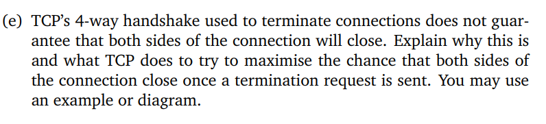

If a termination ACK is lost in transition, the sending host will need to resend and thus the termination process extends longer than 4 steps. 

After an ACK is sent, the server waits to make sure that the client has received an ACK before sending its own termination request. Alternatively, use a 3 way handshake in which an ACK is sent together with a termination request. 

# Multiplexing and Demultiplexing 

## 1. What is UDP socket uniquely identified by 
- Destination IP address and Port number 

## 2. What is TCP socket uniquely identified by

- Source and Dest IP address and Port number (4 tuple)

## 3. Explain what multiplexing entails

- Adding header information to the packet  

## 4. Explain what demultiplexing entails 

- Extracting information from header to deliver message to the correct socket 

## 5. Answer this:

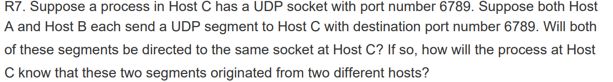

Yes, by source IP address 

## 6. Answer this: 

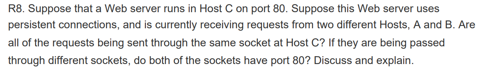

No, HTTP requests runs over TCP protocol hence the web server will have a socket that listens to requests at port 80, then create new socket identified by TCP 4 tuple to server requests from corresponding clients. The newly generated sockets dont have port value of 80.  

# UDP 

## 1. What are the services offered by UDP?

- Best effort delivery - data may not arrive or arrive in incorrect order
- Error checking 
- Multiplexing/Demultiplexing 

## 2. What do some applications prefer UDP over TCP? 

- Complete control over when data is sent. UDP packets are sent immediately while TCP packets may get help up in buffer due to flow/congestion control. 
- Quicker - UDP is connectionless hence requires no 2 RTT for 3 way handshake. 
- Less overhead due to being connectionless. TCP connection requires buffers allocation for each connection, hence a server relying on TCP connection may be able to serve fewer concurrent hosts.
- Smaller header size - TCP segment has 20 bytes of header overhead in every segment; UDP has 8 bytes of overhead. 

## 3. Describe UDP segment structure 

4 fields, 2 bytes each (8 bytes of header in total) 

- Source port num 
- Dest port num 
- Checksum 
- Length - number of bytes in UDP segment (header + data)

# TCP General 

## 1. What services are offered by TCP 

- Reliable data transfer 
- Congestion Control 
- Flow Control 
- Error Detection 
- Multiplexing/Demultiplexing 

## 2. Is TCP connection a virtual circuit? 

No, all state information resides on hosts and not the routers.

## 3. Can two hosts in a TCP connection send data at the same time? 

Yes TCP is a full duplex connection. 

## 4. Can a TCP host send data to multiple hosts over the same TCP connection? 

No TCP is point to point and is between two hosts. 

## 5. What are components of a TCP segment 

TCP header is 20 bytes. 

- Source Dest 
- Dest Dest 
- Checksum 
- Sequence number - used for reliable data transfer service 
- Acknowledgement number - used for reliable data transfer service
- Receive window - for flow control - number of bytes the receiver is willing to accept. 
- Header length - length of TCP header - usually 20 bytes 
- Option fields - negotiate window scaling factor and MSS
- Flag field - 6 bits 
  - ACK - indicate value carried in acknowledgement field is valid, - i.e. the segment contains an acknowledgement for a segment that has been successfully received 
  - RST - rest bit 
  - SYN - for connection setup 
  - FIN - for connection teardown 
  - CWR - explicit congestion notification 
  - ECE - explicit congestion notification 
  - PSH - pass to upper layer immediately 
  - URG - urgent 
- Urgent data pointer (PSH, URG, pointer data usually not used)

## 6. What is the significance of the acknowledgement number in a TCP segment 

Is the next byte that the segment sender is expect to receive. Signifies that segments with sequence number up to the Acknowledgement number has been correctly received. 

## 7. Why are sequence numbers randomly initialised

Avoid mistaking a segment sent from an earlier connection (with the same port numbers) as valid. 

# TCP Flow Control 

## 1. How does TCP receiving host inform the sender of its buffer capacity

Indicate that in the receive window field in TCP segment header

## 2. How does TCP receiver determine the receive window value?

Let `recBuffer` be buffer maximum capacity - total allocated memory. Let `recRead` be the last byte read from buffer and `recReceive` be the last byte received in the buffer, we have: 

$$recReceive - recRead \leq recBuffer$$

Hence the receive window is set as the remainder capacity: 

$$recWindow = recBuffer - (recReceive - recRead) $$

## 3. How does TCP sender ensure it doesn't overflow TCP receiver: 

Let $recWindow$ be the value of the receive window field of the segment it receives, let $lastSent$ be the last byte sent but not acknowledge and $lastAck$ to be the last byte ack, then it makes sure that 

$$lastSent - lastAck \leq recWindow $$

## 4. If at some point, receive window is 0, how does TCP sender ensure that it can still send data to the receiver in the future when the receive window is no longer 0? 

It pokes the receiver with packets of 1 byte of data. If at some points, the receiver has room in its receive buffer, the ACK packet will have a non zero receive window value. 

# TCP Congestion Control 

## 1. How does a TCP sender control how much data to send with regards to congestion and flow control.

Need to keep track of $congestionWindow$ and $receiveWindow$ from TCP segment header. Let $lastSend$ abd $lastAck$ be the last bytes sent and acknowledged from the TCP sender, then the sender makes sure that 

$$lastSend - lastAck \leq \min(congestionWindow, receiveWindow) $$

## 2. Ignoring flow control, what is TCP sender sending rate, taking into account congestion control? 

$$congestionWindow/RTT$$

## 3. Draw FSM for TCP Congestion Control

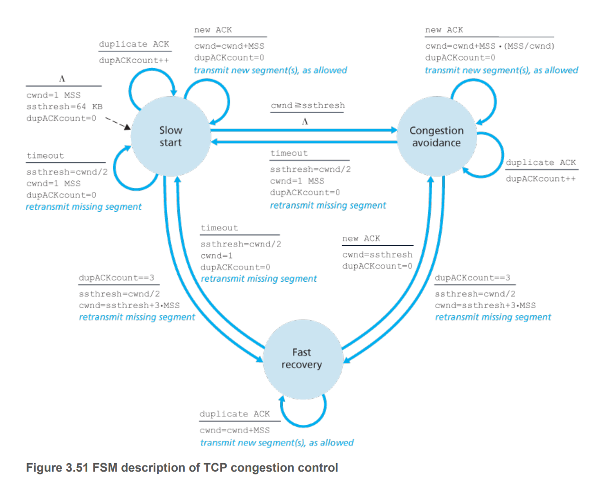

## 4. Describe changes to rate of transfer every RTT for Slow start and Congestion avoidance states: 

Slow start: rate doubles every RTT 

Congestion Avoidance: rate increases by 1 MSS every RTT 

## 5. How does TCP congestion control modify cwnd at every state: 

Slow start: 
- Increases by 1 MSS every new ACK received 
- Resets to 1 MSS at timeout  
- Resets to 1 MSS at 3 duplicate  ACK received and transitions to Fast Recovery

Congestion Avoidance 
- Increases by 1 MSS x MSS /cwnd every new ACK received 
- Resets to 1 MSS at timeout and transitions to slow start 

Fast Recovery 
- Increases by 1 MSS for every duplicate ACK received 
- Reset to 1 MSS at timeout and transition to Slow Start 
- Reset to ssthresh when a new ACK is received and transition to Congestion Avoidance 

## 6. How does TCP determines that a segment is lost? 

- Timeout: if ACK for the segment at base window is not received before timeout -> lost in transit.
- 3 duplicate ACK received: TCP used cumulative acknowledgement, which means that segments with sequence numebr up to ACK sequence number have been correctly received. If there is a reordering of the segments, there will be only one or two duplicate ACKs before a new ACK. If three or more duplicate  ACKs are received, there is a strong indication that the segment is lost.  

## 7. Difference between TCP Tahoe and TCP Reno? 

TCP Tahoe uses Fast Recovery. 

## 8. Why does TCP Tahoe uses Fast Recovery? 

3 duplicate ACKs is only generated if data is flowed between the connection, but some packets may have lost in transit. Since data is still slowing, TCP Tahoe does not want to abruptly reduce transmission rate. (RFC rationale)

# Reliable Data Transfer 

## 1. Describe the mechanism employed in reliable data transfer: 

- Checksum - error detection 
- ACK segment - to indicate correct receipt of a segment (no corruption and in order).
- Negative ACK - to indicate error in received packet (corruption). 
- Sequence number - to account for segments that arrive out of order or missing segment.
- Timeout - resend segment when there is a lost segment. 
- Pipelining - allowing multiple packets to be transmitted but not yet acknowlefdgement to increase channel utilisation. 

## 2. Describe GBN algorithm 

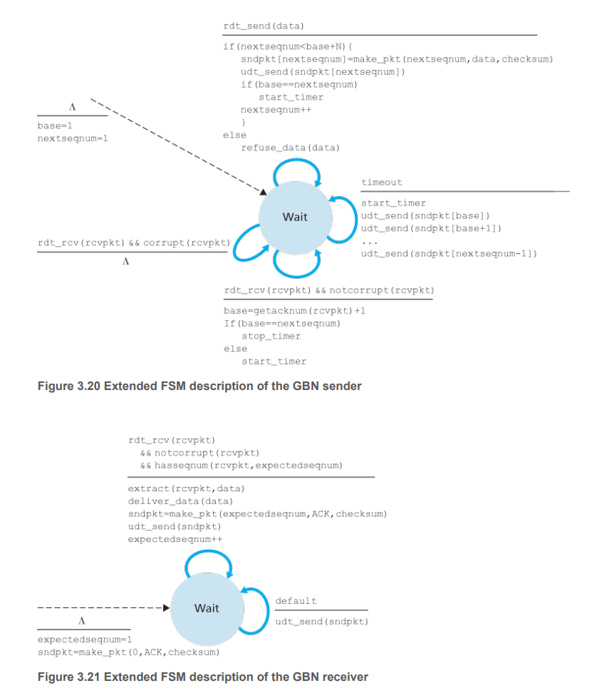

## 3. What is the relationship between sequence number and window size in GBN?

Length of sequence number space = max window size + 1. 

## 4. What is the theoretical maximum sequence number in TCP messages? 

Sequence number in TCP segment is of 32 bits. Hence sequence space is [0, 2^32 - 1]

## 5. Describe Selective Repeat Algorithm 

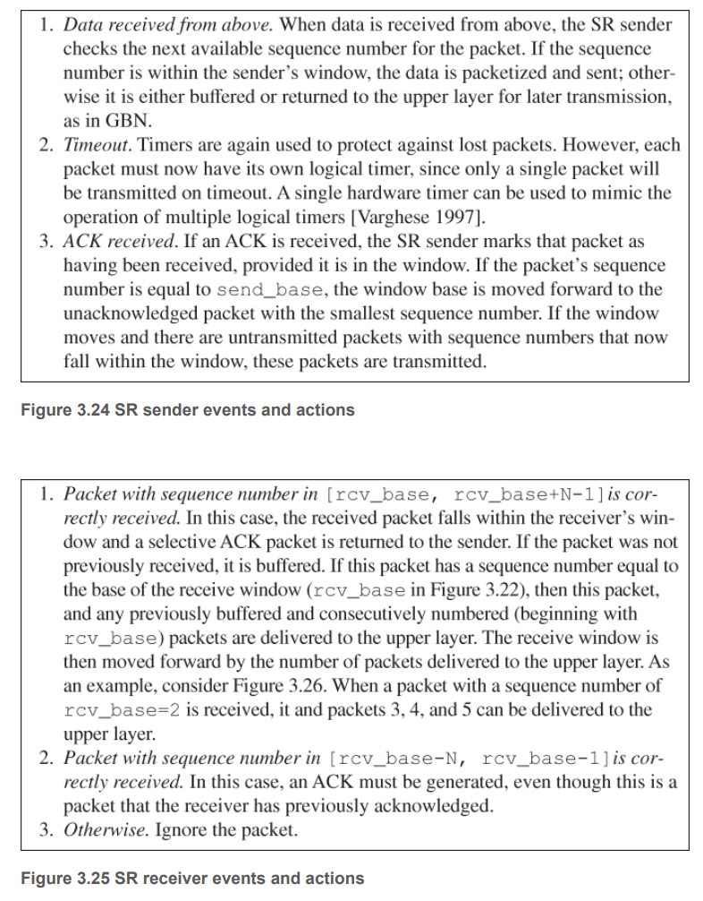

## 6. Why does SR acknowledge packets with sequence number below its current window? 

Suppose the receiver has received packets from sequence number i to i + k (its base window is now at i + k + 1), but its ACKs is lost (sender base is at i). If receiver doesn't ACK packets from i to i + k, sender will not be able to move forward. 

## 7. Relationship between sequence number and window size in SR:

Window size <= len(SeqSpace)/2

## 8. Answer this: 

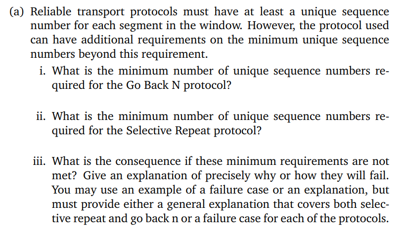

i. Sequence space size must be larger than window size 

ii. Sequence space size must be larger than twice the window size 

iii. 

For GBN, assume sequence number 0, 1, 2. Window size is 3. 

A has segments with sequence numbers 0, 1, 2, 0, 1, 2 to send to B. Assume A sends 0, 1, 2 to B and B receives succesfully. However, the ACKs are lost in transit. Now A resends 0, 1, 2 to B and B cannot distinguish whether this is the original segments or the next set of segments.

For SR, assume sequence number 0, 1, 2, 3. Window size is 3.

A is to send 0, 1, 2, 3, 0, 1, 2, 3 to B. A sends 0, 1, 2 successfully but B acks are lost. A resends 3, 0, 1 to B and segment with seqnum 3 is lost. B cannot distinguish whether segment with number 0 is from the original or the next set. 

## 9. Calculate the utilisation of the channel in this scenario. Suppose RTT = 30 ms, R = 1 Gbps, packet size L = 1000 bytes, stop and wait protocol.

Transmittion time: 

$$d_t = \frac{1000 \times 8}{10^9}= 0.008 ms $$ 

Time until ACK is received, assuming ACK transmission takes no time

$$d_{total} = RTT + d_t = 30.008 ms$$

Hence utilisation 

$$0.008/30.008 = 0.00027 $$

## 10. Consider the setting in the previous question, how big would the window size need to be for the channel utilisation to be greater than 98%, suppose that a packet is 1500 bytes? 

Use pipelining so all packets will be acked in 1 RTT + transmission time. Transmission time for 1 packet: 

$$d_t = 1500 \times 8/10^9 = .012 ms$$

Let's say the window  contains N packets, we have: 

$$U = 0.98 = \frac{0.012 \times N}{30.012} $$

Hence 
$$N = 0.98 \times 30.012/0.012 = 2451 $$

Hence buffer size contains 2451 packets 

## 11. Answer this: 

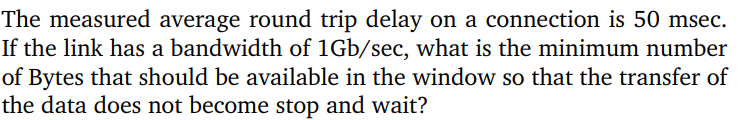

Answer should be 1 Gb/s x 50 ms. (Sending data continuously, utilisation of 1)

# TCP Reliable Data Transfer 

## 1. Describe TCP Data Transfer 

Sender 
- Init: 
  - base = 1
  - nextSeqNum =1 
- Called from above with data 
  - send packet with sequence num = nextSeqNum 
  - nextSeqNum += len(data)
  - If timer not running -> run timer 
- Receive ACK with seqnum = y
  - base = y 
  - If there are unAck segments: 
    - timer.start 
- Timeout 
  - Retransmit unACK segment with smallest seqnum 

Receiver: 
- Init:
  - base = 1 
- Receive packet with seqnum >= base:
  - base = seqnum + len(data) 
  - send ACK with ACK num = base 
- Receive packet with seqnum < base
  - send ACK with ACK num = base 

## 2. Suppose A sends a segment to B with seq = 92 and has 8 bytes of data. After sending this, B sends back to A with ack = 100, but this ack is lost. Timeout occurs and A resends the packet. Will B send A an ACK packet? 

Yes. It will resend the ACK packet. 

## 3. A sends two segments back to back. First seq=92 with len data = 8. Second seq = 100 with len data = 20. Suppose that both ACK sent by B is lost. The first segment timeouts and A resends. Suppose the ACK sent by B now arrives at A, will A resend the second message?

A -> B, SEQ = 92. Received
A -> B, SEQ = 100, Received
B -> A, ACK = 100, Lost 
B -> A, ACK = 120, Lost 
A -> B, SEQ = 92. Received
B -> A, ACK = 120, Received

A will not resend the second packet 

## 4. A sends two segments back to back. First seq=92 with len data = 8. Second seq = 100 with len data = 120. Suppose only the second ACK arrives at A. Will A resend the first or second message? 

A -> B, SEQ = 92, Received
A -> B, SEQ = 100, Received 
B -> A, ACK = 100, Lost 
B -> A, ACK = 120, Received 

A will not send either the first or second segments again. 

## 5. Describe how TCP determines the TimeOut 

Keep in memory 
- SampleRTT - refreshed every trip 
- EstimateRTT 
- DevRTT 
- TimeOut

$$EstimateRTT = (1-\alpha) EstimateRTT + \alpha SampleRTT $$

$$DevRTT = (1-\beta) DevRTT + \beta |SampleRTT - EstiamteRTT| $$

$$Timeout = EstiamteRTT + 4 DevRTT $$

## 6. Answer this

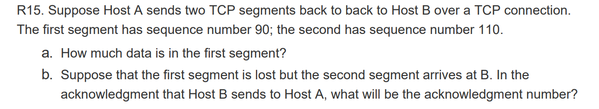

a. 20 bytes 

b. ACK number = 90 

## 7. Find Checksum value for 01010011, 01100110, 01110100:

Sum: 0010 1110

1s Complement: 1101 0001

## 8. Find checksum value for 01011100 and 01100101

Sum: 1100 0001

1s: 0011 1110

## 9. Find checksum value for 11011010 and 01100101

Sum: 0100 0000 

1s: 1011 1111

## 10. Answer this: 

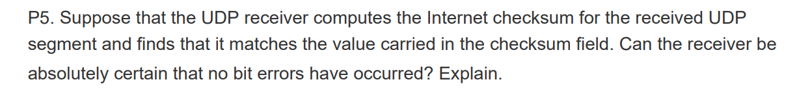

No, suppose there are two original bits are 0 and 1, after flipping to 1 and 0, checksum results are the same. 

## 11. Why does TCP avoids measuring the sampleRTT for retransmitted segments? 

If A sends a segment to B and the ACK from B experience queing delay that leads to timeout. A now resends the packet. Suppose we measure sampleRTT for retransmitted segments, the delayed ACK now arrives and A mistakenly use this value as SampleRTT. 

## 12.  Answer this: 

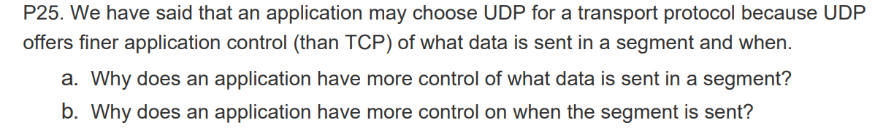

a. TCP segments are put in buffer and at any time, TCP grabs 1 MSS of data from the buffer which can include up to any part of the message. OTOH, for UDP, data enveloped in segment is sent as is. 

b. TCP may have flow and congestion control so a segment may need to wait in buffer. 

## 13. Answer this: 

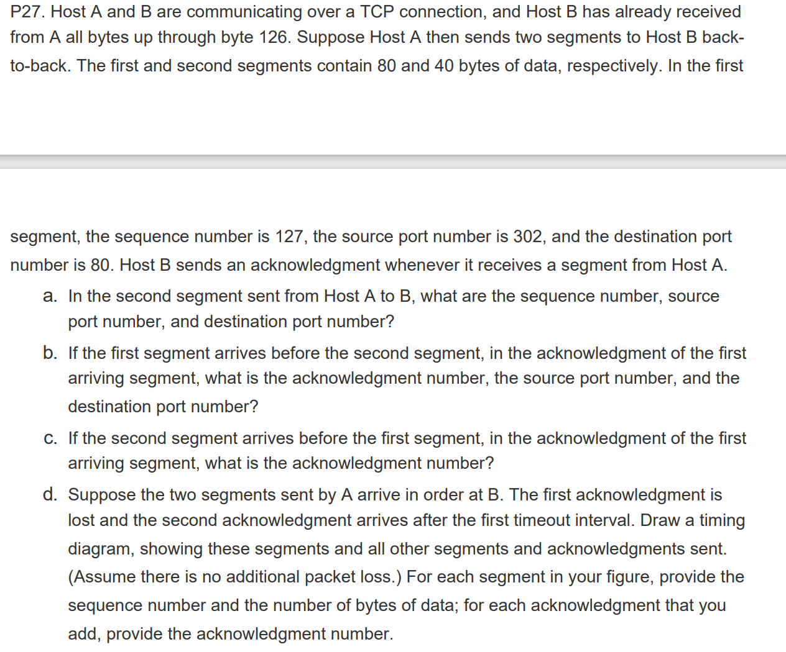

a. Sequence number = 127 + 80 = 207. Source port = 302, dest port = 80.

b. ACK = 207, source port = 80, dest port = 302 

c. ACK = 127, source port = 80, dest port = 302

d. 

A -> B, Seq = 127, Received 
A -> B, Seq = 207, Received 
B -> A, ACK = 207, Lost
Timeout 
A -> B, Seq = 127, Received 
B -> A, ACK = 247, Received
B -> A, ACK = 247, Received

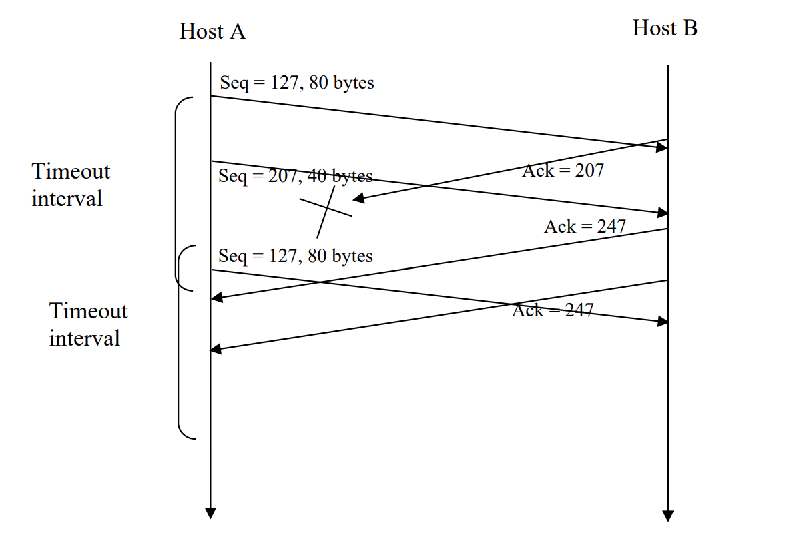

## 14. Review P40 in the book Chapter 3

## 15. Answer this

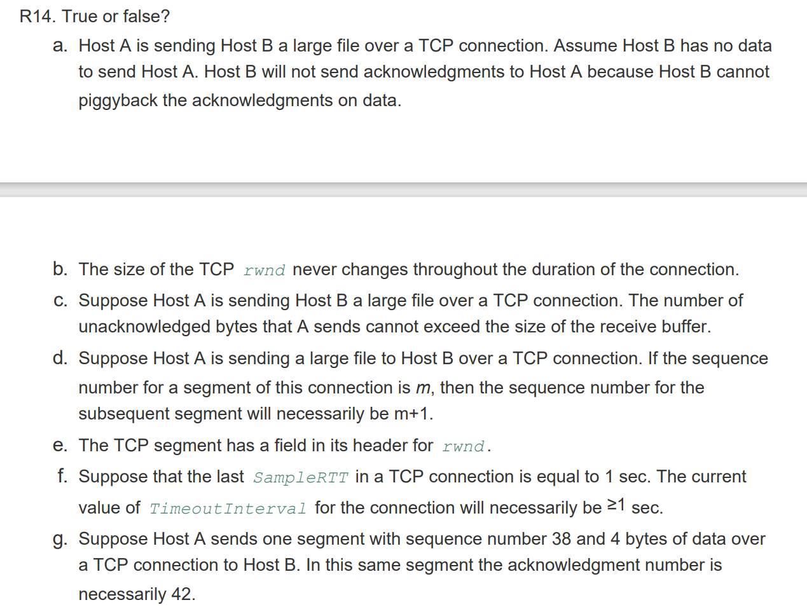

a. False - will always send ACK for TCP receiver

b. False - will change as a form of flow control 

c. True - as part of flow control 

d. False - will be m + len(data) 

e. True - receive window field 

f. False - estimateRTT and devRTT can be both small 

g. False - the ACK is what A to be received from B 

## 16. Answer this:

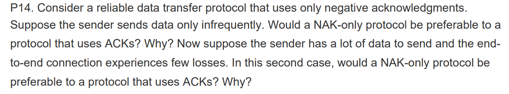

In NAK only protocol, the loss of packet x is only detected when packet x + 1 is received. The receiver sees that it has received x - 1 and x + 1 but not x so it will issue a NAK. If there is a long delay, it will take a substantial amount of time until x can be recovered. 

If data is sent often, then NAK only scheme could happen quickly. If there are few errors, ACKs are never sent and NAKs are only sent when needed, hence there will be a significant reduction in feedback.

## 17. Answer this

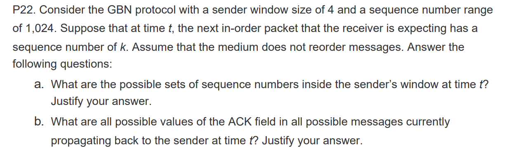

a. Let N be the window size, since the receiver is expecting a sequence number of k, segments numbered up to k - 1 have been ACKed. If ACK numbered k - 1 has been received by the sender, sender window begins at k and is length length N, hence [k, K + N - 1]. Considering the lowest possible ACK that sender has received such that segment numbered k - 1 is sent, let x be this number + 1, we have that from x to k - 1, the total number is N, hence x = k - N, in which case sender contains [k - N, k - 1]. All possible sequence numbers are [k - N, k + N - 1]. 

b. Flying back [k - N, k - 1] based on reasoning of part a 

## 18. Answer this

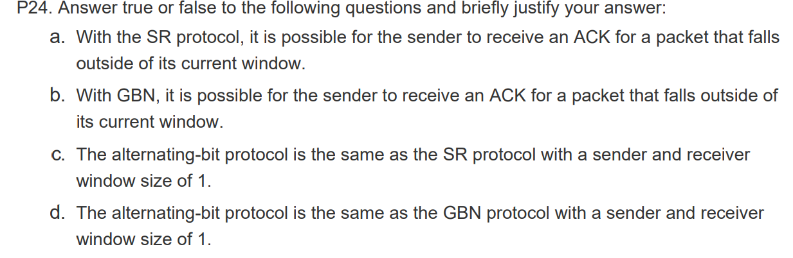

a. True. Assume A sends segments 1 2 3 to B. B ACKs 1, 2, 3 but the packets got held up. A resends segments 1 2 3 to B. B resends ACKs 1, 2, 3. The old ACKs arrive and push A base window to 4 5 6. The new ACK arrive and is below A's current window. 

b: True. Assume A sends segments numbered 1, 2, 3 to B. B receives and send ACK numbered 1, 2, 3. The medium reorders the ACK to 3, 2, 1. A receives 3 and moves window to 4, 5, 6, before receiving 1, 2 which is behind its window. 

c: True

d: True 

## 19. Answer this

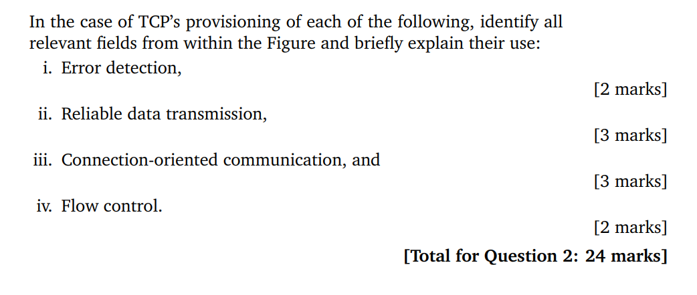

i. Checksum - for detecting error 

ii. 
Sequence number and Ack knowledgement number - to determine whether packets arrive in order or packets have been missing. 
Checksum - for checking whether there is channel corruption. 

iii. 
- ACK, FIN, SYN, RST - used for initiating and terminating connections 
- Source Port, Dest Port - for multiplexing and demultiplexing to the communicate with the correct remote process. 

iv. Window size - for flow control 