# Network Layer Data Plane

- There is a piece of network layer in every host and router in the network. 
- Network layer is divided into `data plane` and `control plane`
  - Data plane: per router functions that determine how a datagram arriving on one input links is forwarded (IP forwarding). IP protocol.
  - Control plane: network wide logic - how a datagram is routed - routing algorithms etc
- Traditionally, `control-plane` routing protocols and `data plane` forwarding functions are implemented monolithically.
- Modern `SDN` or software-defined networking separates those into different services in a remote controller. 

##  Network layer functions:

 - `Forwarding`: When a packet arrives at a router's input link, router moves the packet to the appropriate output link (local process to move a packet from an input interface to an output interface).
 - `Routing`: layer must determine the route or path taken by packets as they flow from sender to receiver (network-wide process to determine the end to end path)

## Control Plane - Traditional Approach 

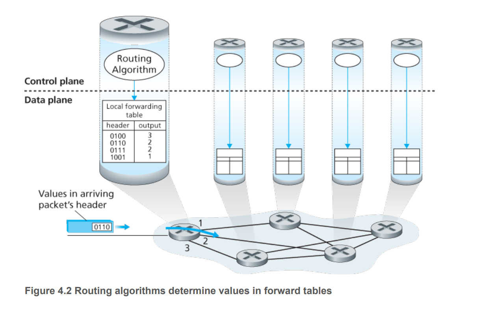

- Routing algorithm determines the content of `forwarding table`.
- Both the forwarding and routing functions are contained with a router.
- Each router has a routing component that communicates with the routing component of other routers. 

## Control Plane - SDN Approach

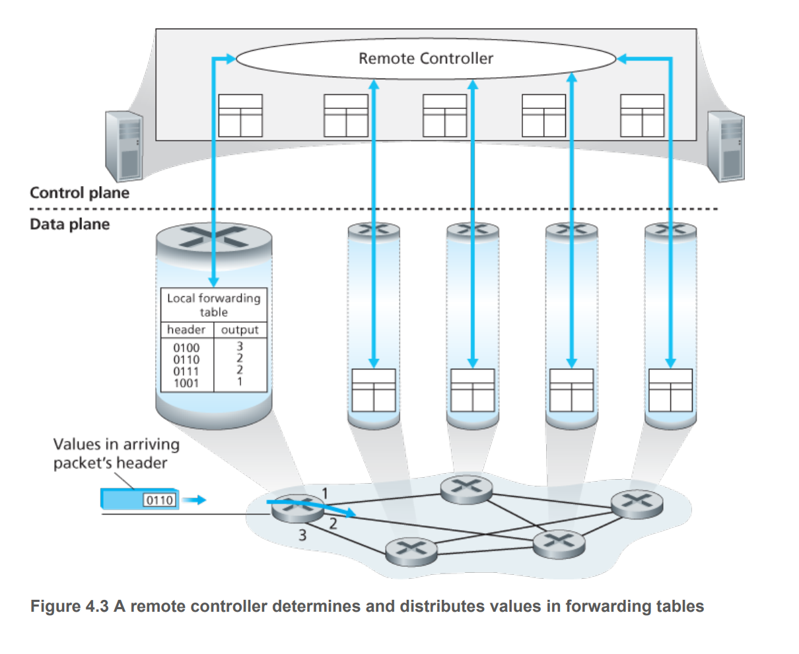

- A remote control computes and distributes the forwarding tables to be used by the routers. 
- Routers perform forwarding
- Remote controller performs routing
- Separation of concerns 

## Network Layer Services: 

For the Internet network: 

- `Best effort Service`: packets may not be delivered, and when received, may not be in order. 

For ATM network: 

- `Guaranteed in-order bounded delay`: packets from sender will be received in order, up to a maximum amount of delay 

# IP Protocols 

## IPv4 

### IPv4 Datagram format
- `Version Number`: IPv4 or IPv6
- `Identifier,  flags, fragmentation offset` - for IP fragmentation (IPv6 does not have fragmentation).
- `Time to live` - everytime a datagram is processed by a router, this value is decremented. If the value reaches 0, the router will drop it. This ensures datagram do not live forever on the internet. 
- `Protocol`: TCP/UDP protocol
- `Checksum`: treat every 2 bytes in header as number and sum with 1s complement arithmetic. Must be recomputed at every router since `TTL` will be decremented everytime it passes a router. 
- `Source and Dest IP Addr`: IP addresses

### IPv4 Fragmentation 

Because the maximum amount of data that can be carried in a link-layer frame is `MTU` or maximum tranmission unit, the maxmum size of an IP datagrame is constrained by `MTU`. Different links on the path from sender to receiver can have different link protocols and different `MTU`, hence a datagram from a link with larger `MTU` may need to be broken up into smaller chunks when transmitted over a link with smaller `MTU`. This process is called `fragmentation`. Fragments will be reassembled when arriving at the destination. The end system is responsible for reassembling the fragmented message. 

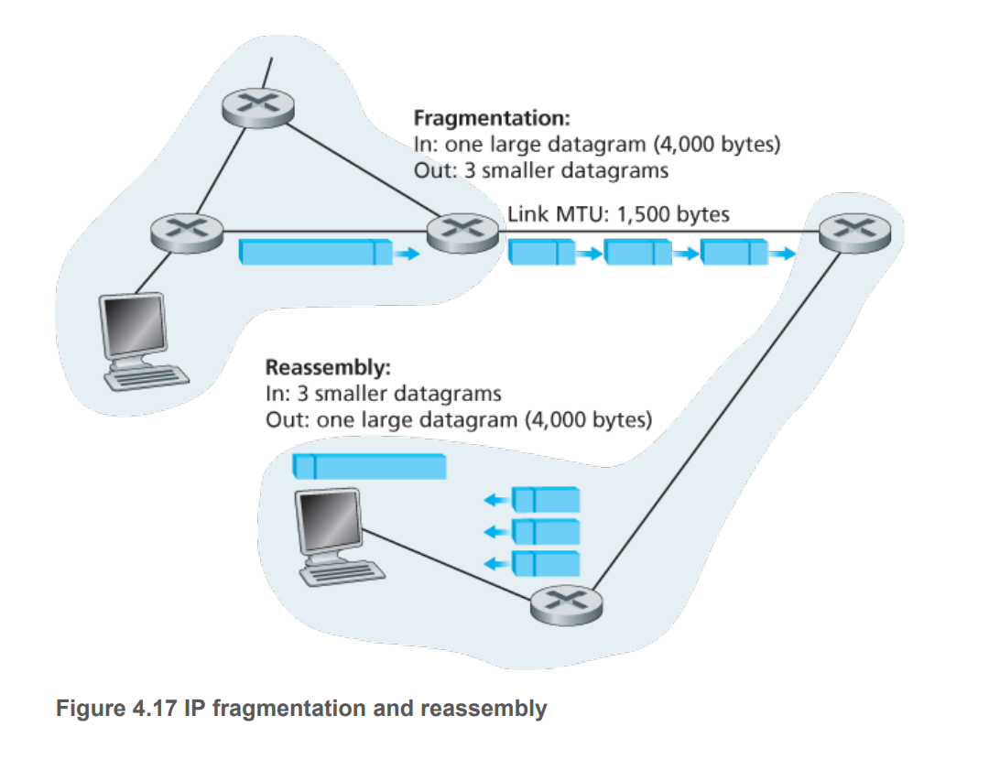

- `Identification`: fragments of the same datagram have the same `identification` value. Different datagrams have different identification values.
- `Flag`: set to 1 if a fragment is not a last fragment, and 0 if it is. 
- `Offset`: the fragment index within the original IP datagram. 

### IPv4 Addressing 

- Boundary between a host and a physical link is an interface. 
- The boundary between a router and a physical link is also an interface.
- Each interface has an IP address attached to it.
- Hence a router has many interfaces with different incoming and outgoing links with different IP addresses. 
- Each IP address is 32 bits long and hence $2^{32}$ possible IP addresses.
- IP addaress is typically grouped by 4 numbers of 8 bits, separated by a `.`. Each number has a range from `0` to $255 = 2^8-1$
- The IP address for each interface must be unique, except for those behind a NAT
- `Subnet`: IP address of interfaces of sub networks have similar addresses up to `k` bits. 
- `Subnet Mask`: IP addressing of a subnet `xxxx.xxxx.xxxx.xxxx/k` means that the first k bits define the subnet. Other hosts attached to a subnet must have their IP addresses following the rule of the masking. 
- To determine the subnets, detach each interface from its host or router. The connected components form subnets. 
- The `k` most significant bits in a subnet mask is called the `prefix`.
- An organisation is typically assigned a block of contiguous addresses with a common prefix.
- The remaining `32-k` bits are used for ID the devices within the organisation. 
- The lower-order bits may have an additional subnet structure.  

### How to obtain a block of address

- Contact corresponding ISP 
- ISPs themselves get their block of IP from ICANN

### How to obtain a host address

- Host addresses are configured using Dynamic Host Configuration Protocol (`DHCP`)
- `DHCP` can be configured so that a given host receives the same IP address or a temporary IP address everytime it logs in. 
- `DHPC` is a client server architecture. Each subnet will either have a `DHPC` server, or a router that knows the `DHPC` server of a lower level subnet. 
- The process for a newly arriving host to get its address is as follows: 
  - `DHCP discovery`: send a DHCP discover message under UDP to port 67. The dest IP address is 255.255.255.255 and src IP address is 0.0.0.0. This IP datagram is passed to the link layer, broadcasted to all nodes attached to the subnet. 
  - `DHCP server offer`: DHPC server receiving DHCP discover message responds witha DCHP offer message broadcast to all nodes in the subnets, using the IP broadcast address 255.255.255.255. The offer message contains the transaction IP, proposed IP, network mask and IP lease time. 
  - `DHCP request`: newly arriving client responds to the offer with DHCP request message.
  - `DHCP ACK`: the server responds to the request message with a DHCP ACK message. 
  - Only after this will the newly arrived client gets the allocated IP address

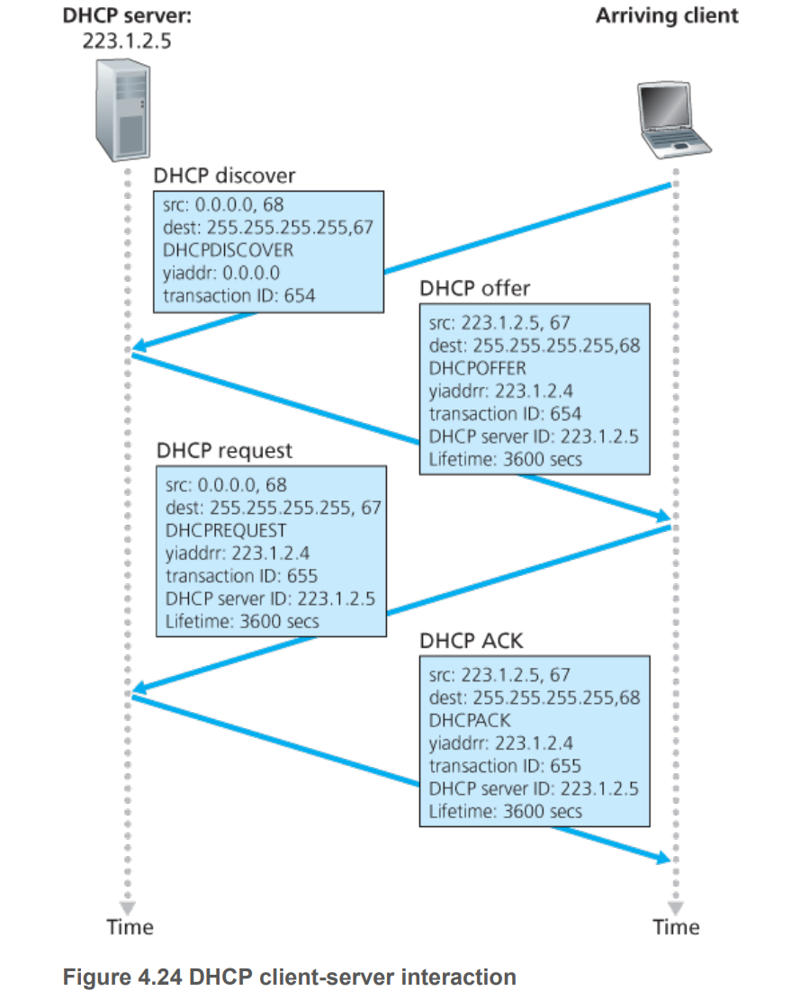

## IPv6

### Changes from IPv4:

- 32 bits to 128 bits 
- Anycast address: delivered to anyone of a group of hosts. 
- 40 byte header
- Flow labeling - differentiate among the flows, even if the meaning is not determined. 
- No fragmentation and reassembly at intermediate routers. The operations are performed at end segments. If an IPv6 data gram is too large to be forwarded over the outgoing link -> send back a Packet too big ICMP error message. Fragmentation and reassembly is time consuming, so doing this offload the work to end systems which streamlines the process. 
- No header checksum - expensive operation
- No option. 

### Transitioning from IPv4 to IPv6

- How will the public internet transition from IPv4 to IPv6. Several options:
- Flag day - when all machines to be turned off and upgraded to IPv6. Impractical. 
- Tunneling: 
  - Suppose 2 IPv6 nodes send datagrams through IPv4 routers. 
  - Tunnel set of IPv4 routers. 
  - IPv6 sender sends IPv6 datagram and put in payload of IPv4 datagram to be sent through IPv4 routers. 
  - IPv6 receiver receives the IPv4 datagram and extract the IPv6 payload from IPv4 datagram then process the IPv6 datagram. 

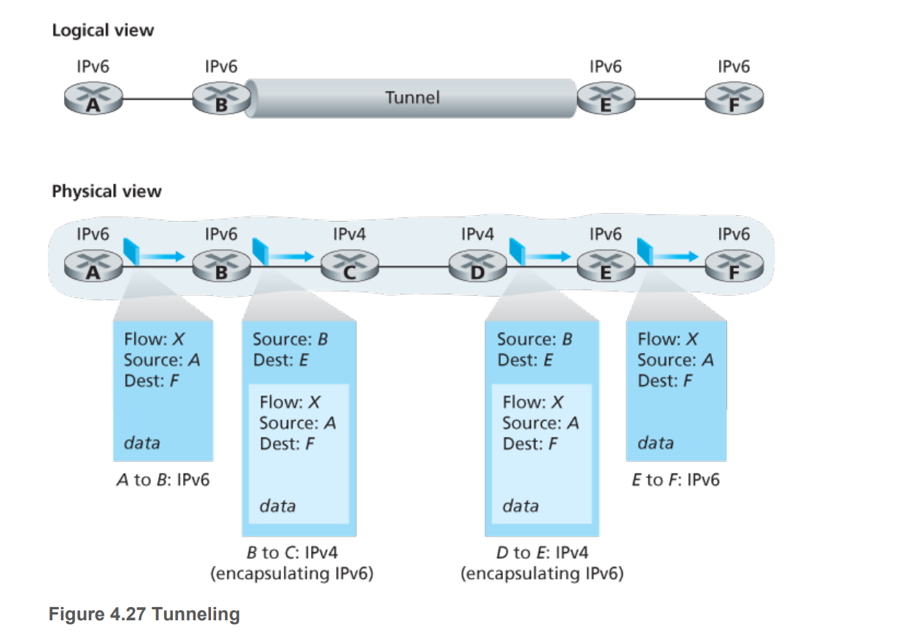

# SDN and Generalised Forwarding 

- Forwarding is the action as looking up a destination IP address and sending the packet to the switching fabric leading to output port.
- Generalised forwarding includes match plus action, in which the action can be
  - Load balancing packets across outgoing interfaces leading to the service 
  - Rewriting header - NAT 
  - Blocking/dropping packet - firewall 
- In simple terms, forwarding table now has an additonal fields:  

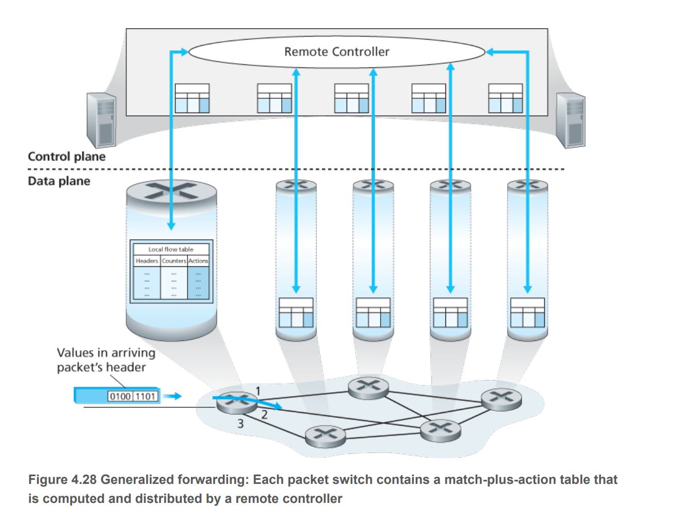

Every entry in match plus action forwarding table or `flow table` includes 

- Header field values to match incoming packets 
- Counters - updated as packets are matched to flow table entries. - i.e. number of packets that have been matched and time since last updated.
- Actions to take when a packet matches an entry - i.e. forward to port, drop packet, make copies and broadcast, rewrite header fields, etc 

## Match 

- Can be made based on selected fields from three layers of protocol headers (Link, Network, Transport)
- Not all fields in an IP header can be matched - trade off between functionality and complexity.

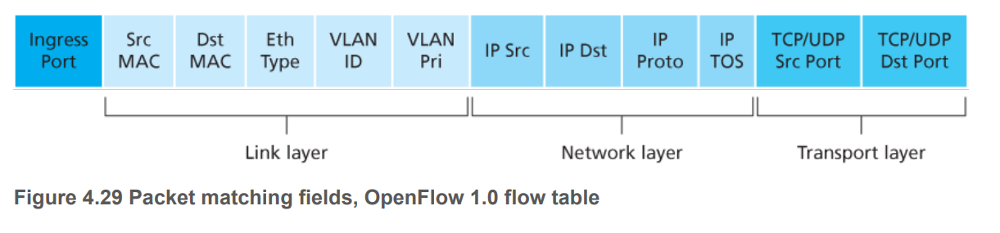

## Action

- Forwarding:
  - To a particular output port 
  - Broadcast over all ports
  - Multicast over a selected set of ports 
- Dropping - firewall
- Modify fields - NAT table 

## Example 

Given the network structure: 
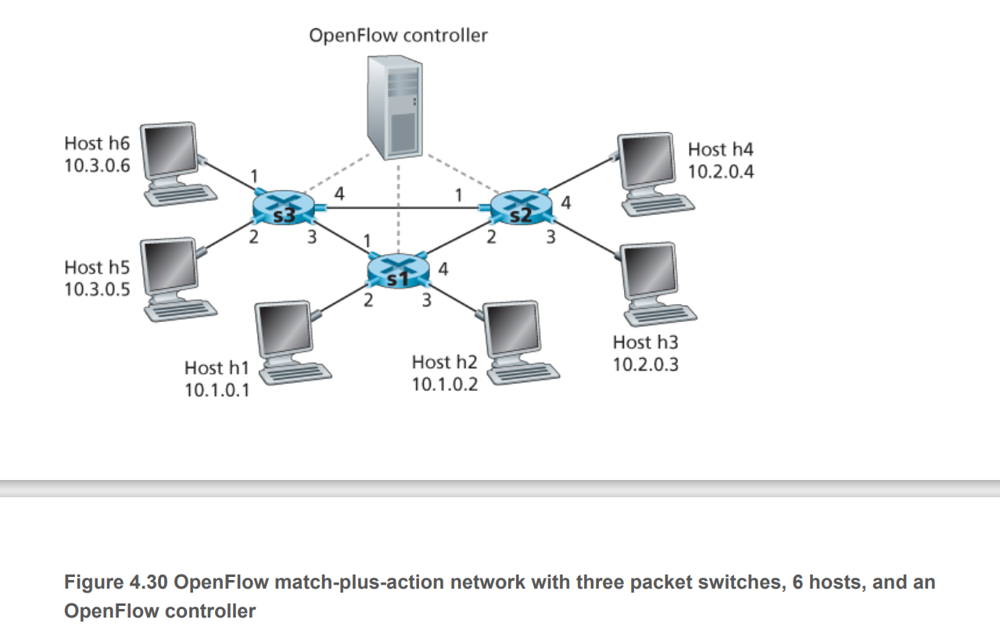

### Setup 1: message from h5 or h5 to be received by h4 or h4 after routing through s1: 

- S1 to accept messages with src IP `10.3.*.*` and dst IP `10.2.*.*` from port 1 and redirects to S2 via port 4: 

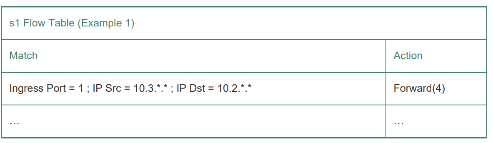

-  S3 to send messages with src IP `10.3.*.*` and dst IP `10.2.*.*` via port 3

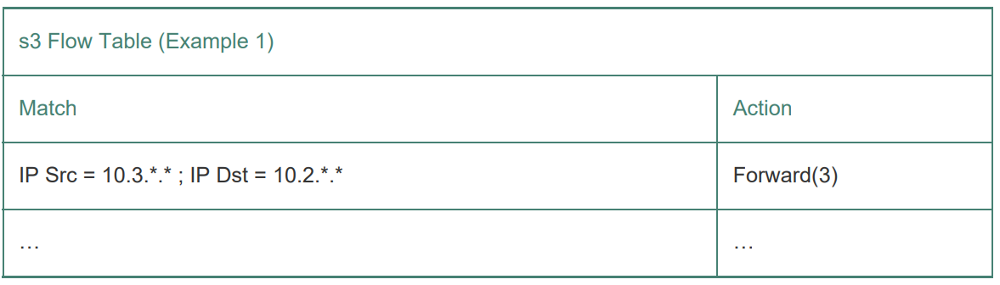

- S2 to receive message from port 2 directing to h4 over port 4 and h3 over port 3: 

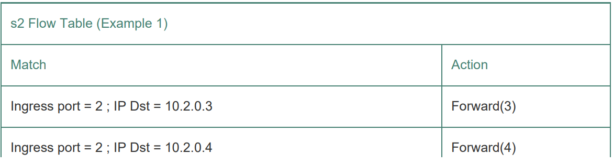

### Setup 2: Load balancing 

Datagrams from h3 and h4 are to be sent to a server with replicated servers h1 and h2. For load balancing, traffic from h3 to h1 or h2 is sent directly from s1 to s2, while from h4 will be routed to s3 then s1.

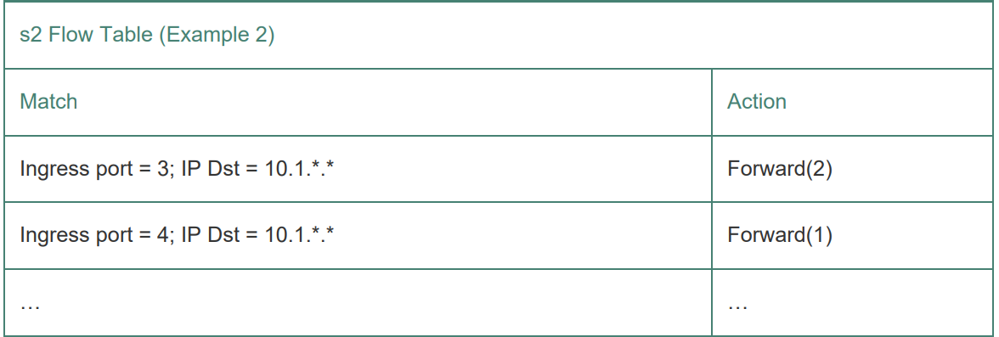

### Setup 3: Firewall 

S2 only receives traffic sent from s3 hosts: 

Since rules for other sources are not defined, the packets coming from other hosts will be dropped.