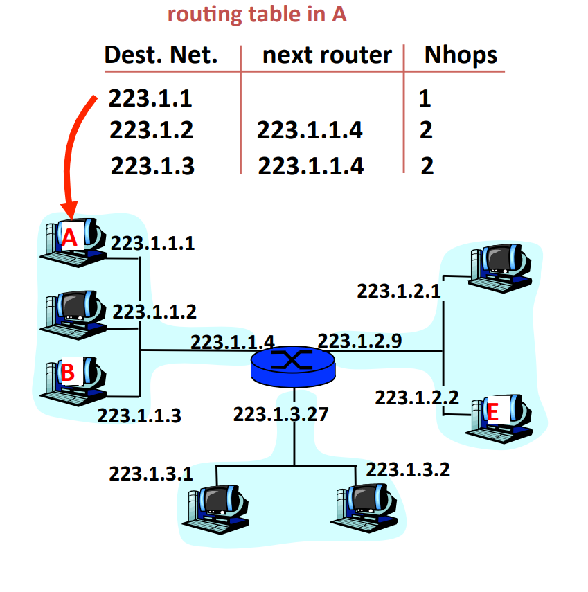
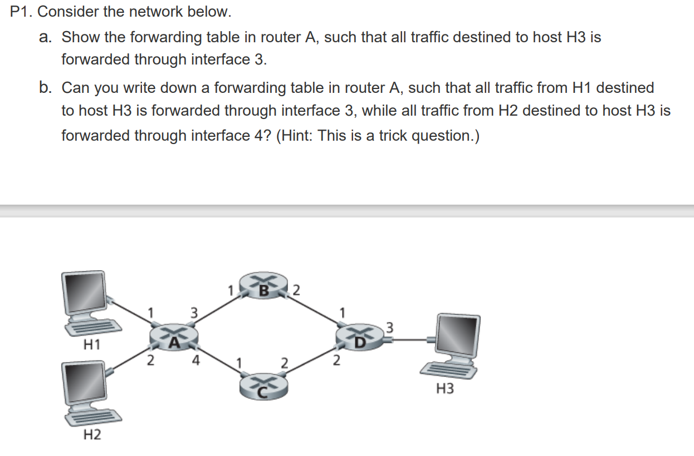
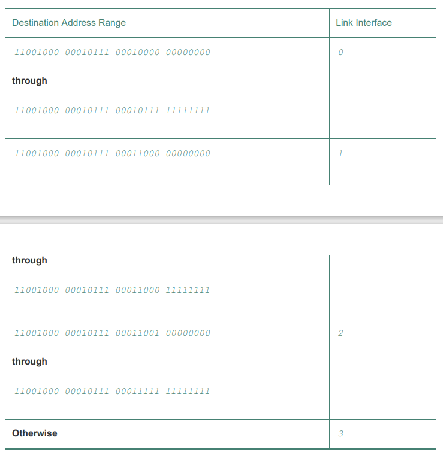
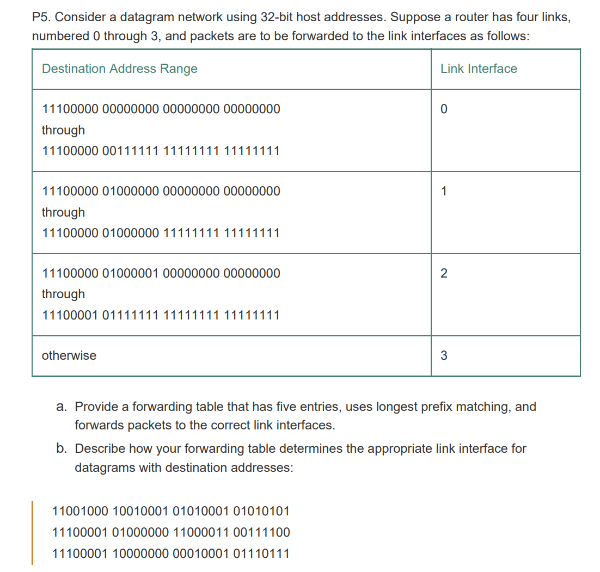
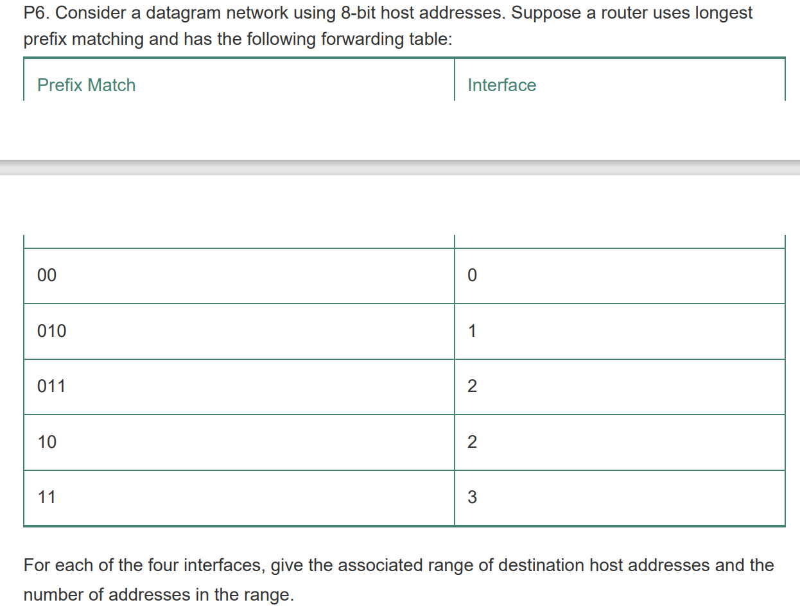
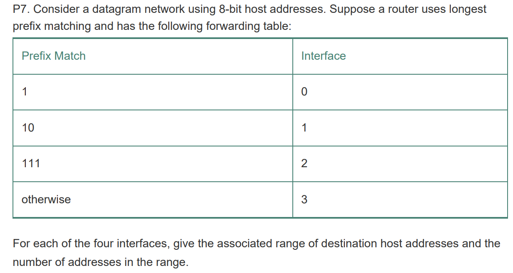

# General 

## 1. What is a virtual circuit

Connection oriented switching:
- Resources mst be reserved for the duration of the session 
- Route is predetermined
- Data flows through predetermined path and received in sequence 
- Global header is needed because every packet takes the same route. The remaining packets do not need global header, just the first packet. 
- Require setup, data transfer and teardown.
- Reliable 
- Costly and low utilisation of resources 
- Data is guaranteed to be delivered. 

## 2. What is a datagram network 

- Connectionless, no resources allocation 
- No predetermined route, data is determined per router on case by case basis 
- Header is required for every packet 
- Data may get lost in transit or appear out of order 
- No need for setup, inexpensive, may offer better resource utilisation 

## 3. What are the pros and cons of virtual circuit versus datagram network

Pros virtual circuit: 

- Data is guaranteed to be delivered
- Data is delivered in order 
- No need for expensive routing protocol

Cons virtual circuit 

- Predetermined path, if a node breaks, the system goes down 
- Resource allocation requires setup and teardown, maybe expensive 
- Low utilisation of resources if the reserved task does not utilised the full link - i.e. other users cannot share the resource 

Pros Datagram network 

- Inexpensive setup costs
- Able to share resources with other user 
- More robust - i.e. if a router break, routing path can be changed dynamically

Cons of Datagram network 

- Unreliable data transfer, packet loss, packet not in order. 

## 4. What is the difference between routing and forwarding: 

- Forwarding (data plane) is constrained to local router - determine outgoing interface for a datagram arriving from an incoming interface based on forwarding table.

- Routing (control plane) has network wide significance - determine the best path from one end system to another given source and dest IP addreses. 

## 5. Describe the process for delivering message from A to B and to E in this diagram: 

A to  B: 

A creates an IP datagram addressing B and passes it to its adapter. Adapter looks up the address of B using ARQ table and sees that B is in the same subnet as A. Adapter creates a frame enveloping the datagram addressing B (B's MAC address) and passes to the network.

A to E: 

A performs a table look up using its forwarding table and see that to send to E it needs to send to router 223.1.1.4. It passes the datagram to the router at interface with IP 223.1.1.4. Router extracts the datagram from frame, uses its forward table to dertermine the outgoing link to 223.1.2.9. The adapter at that address envelops the datagram inside a frame addressing E's MAC address. 

## 6.  Let’s review some of the terminology used in this textbook. Recall that the name of a transport-layer packet is segment and that the name of a link-layer packet is frame. What is the name of a network-layer packet? Recall that both routers and link-layer switches are called packet switches. What is the fundamental difference between a router and link-layer switch?

Name of network layer packet is datagram. Router performs store and forward using IP address and switch using MAC address. 

## 7.  We noted that network layer functionality can be broadly divided into data plane functionality and control plane functionality. What are the main functions of the data plane? Of the control plane?

Data plane - perform packet forwarding. Determine an appropriate outgoing interface for a packet based on destination IP address. Use hardware and local 

Control Plane - network wide best path - software 

## 8.  What is the role of the forwarding table within a router?

Determine outgoing interface based on IP address (destination)

## 9. We said that a network layer’s service model “defines the characteristics of end-to-end transport of packets between sending and receiving hosts.” What is the service model of the Internet’s network layer? What guarantees are made by the Internet’s service model regarding the host-to-host delivery of datagrams?

Unreliable data transfer 

## 10. Consider sending a 2400-byte datagram into a link that has an MTU of 700 bytes. Suppose the original datagram is stamped with the identification number 422. How many fragments are generated? What are the values in the various fields in the IP datagram(s) generated related to fragmentation?

Maximum data size is 700 - 20 = 680 bytes 
Number of fragments = (2400 - 20)/680 = 4 fragments
Each fragment will have ID = 422
Each fragment will be of size 700 bytes except the last one. 
The offset will be 0, 85, 170, 255. Each will have flag = 1 except last which has flag = 0

## 11. How to determine the offset value in IP fragments:

A fragment number x means there were 8x bytes sent in previous fragments.

## 12. Suppose a router receives an IP packet containing 600 data bytes and has to forward the packet to a network with maximum transmission unit of 200 bytes. Assume that IP header is 20 bytes long. What are fragment offset values for divided packets?

Data size in each fragment: 200 - 20 = 180 bytes - must be a multiple of 8 hence 176 
Number of fragments required: 600/176 = 4 fragments
Fragment id: 0, 22, 44, 66

## 13. Suppose datagrams are limited to 1,500 bytes (including header) between source Host A and destination Host B. Assuming a 20-byte IP header, how many datagrams would be required to send an MP3 consisting of 5 million bytes?Explain how you computed your answer

Assume using TCP with 20 bytes of header: 

Data size = 1500 - 40 = 1460

Number of data grams: (5,000,000)/1460 = 3425 datagrams

# IPv4 Addresses 

## 1. How many bits are there in IP address, how are they grouped

32 bits. 4 groups of 8 bits (each from 0 to 255)

## 2. IP adress classful addressing

In classful addressing, the first 8, 16, 24 bits are used for addressing the network part and the remaining 24, 16, 8 bits are used for host addressing.

In class A, the first bit is set to 0 

In class B, the first two bits are set to 10 

In class C, the first three bits are set to 110 

In class D, the first four bits are set to 1110

## 3. How many hosts can different classes support for classful addressing? 

Two addresses are reserved for special issues

Class A: 24 bits are for host addressing hence: $2^{24} - 2 = 16,777,214$ hosts 

Class B: 16 bits are for host addressing: $2^{16}-2=65,534$ hosts

Class C: 8 bits are for host addressing: $2^8-2=254$ hosts

## 3. How many networks can classful addressing support for different classes? 

Class A - 8 bit for network addressing, 1 fixed bit: $2^7-2= 126$ networks 

Class B - 16 bits for network addressing, 2 fix bits: $2^{14}= 16,384$ networks

Class C - 24 bits, 3 reserved bits: $2^{21} = 2,097,152$ networks

## 4. Why was CIDR used instead of classful addressing? 

Due to increasing number of organisations using the internet, class B or class C addressing are used for an organisation. Class C only supports 254 hosts, which is too few for most large organisations. On the other hand, class B host space is too large, which often leads to waste (addresses that could be used by other organisations)

## 5. Explain the notation a.b.c.d/x for subnet masking:

The first x bits define the subnet address, the remaining n - x determine the host address. 

## 6. What is the broadcast address in CIDR: 

For current subnet: set host bits to 1 

For local network: 255.255.255.255. When a host delivers a message to this address, it is delivered to all hosts on the subnet. 

## 7. Describe the process for a new host to acquire IP address: 

DHCP protocol. 

- New host broadcast DHCP discover request message
- DHCP server broadcasts DHCP offer with yiaddr 
- New host accepts offer - resend offer to DHCP server 
- DHCP server sends reply
- Host now has the offered address 

## 8. How big is an IP header: 

20 bytes 

## 9. What is included in an IP datagram: 

- Version
- Header length 
- Type of service 
- Length of datagram (header + data)
- Source IP - 32 bits 
- Dest IP - 32 bits
- Flag bit 
- Identifier - 16 bits 
- Fragment offset
- Checksum
- TTL 
- Protocol - transport layer protocol - TCP or UDP 
- Options (tinestamp, route taken)

## 10. Describe IPv4 fragmentation process: 

- New segment is assigned an identifier.
- Fragments belong to the same segment has the same identifier 
- Fragment used to describe positioning 
- Flag - if last fragment then flag = 0 

## 11. Suppose Host A sends Host B a TCP segment encapsulated in an IP datagram. When Host B receives the datagram, how does the network layer in Host B know it should pass the segment (that is, the payload of the datagram) to TCP rather than to UDP or to some other upper-layer protocol?

Protocol header field

## 12. What field in the IP header can be used to ensure that a packet is forwarded through no more than N routers?

TTL 

## 13. Recall that we saw the Internet checksum being used in both transport-layer segment and in network-layer datagrams. Now consider a transport layer segment encapsulated in an IP datagram. Are the checksums in the segment header and datagram header computed over any common bytes in the IP datagram? Explain your answer.

IP checksum done over IP header. TCP/UDP checksum done over TCP/UDP header and payload

## 14. When a large datagram is fragmented into multiple smaller datagrams, where are these smaller datagrams reassembled into a single larger datagram? 

Destination host

## 15. Suppose there are three routers between a source host and a destination host. Ignoring fragmentation, an IP datagram sent from the source host to the destination host will travel over how many interfaces? How many forwarding tables will be indexed to move the datagram from the source to the destination?

Sender -> Router1 x 2 -> Router2 x 2 -> Router 3x2 -> Receiver: 8 interfaces 

Sender -> Router 1, Router1 -> Router2, Router2->Router3, Router3->Dest: 4 tables

## 16. Suppose an application generates chunks of 40 bytes of data every 20 msec, and each chunk gets encapsulated in a TCP segment and then an IP datagram. What percentage of each datagram will be overhead, and what percentage will be application data?

40 bytes of data, 40 bytes header: 50%

## 17. What is a private network address? Should a datagram with a private network address ever be present in the larger public Internet? Explain

Network addresses that are only meaningful to hosts on the same subnet. No because there may be multiple organisations sharing the same private addresses.

## 18. Answer this:

a. Address: H3, interface: 3

b. Not possible since forward table is based only on destination address

## 19. Summarise this table:

- Distinguish between 0 and 1: 
  - 11001000 00010111 00010
- Distinguish between 1 and 2: 
  - 11001000 00010111 00011000
- Distinguish between 2 and 3:
  - 11001000 00010111 00011
- Otherwise 
- Hence 4 entries 

## 20. Answer this: 

a. 

- 0: 11100000 00
- 1: 11100000 01000000
- 2: 1110000
- 3: 11100001 1 
- 3: Otherwise

b. 
First: 3
Second: 2
Third: 3

## 21. Consider a router that interconnects three subnets: Subnet 1, Subnet 2, and Subnet 3. Suppose all of the interfaces in each of these three subnets are required to have the prefix 223.1.17/24. Also suppose that Subnet 1 is required to support at least 60 interfaces, Subnet 2 is to support at least 90 interfaces, and Subnet 3 is to support at least 12 interfaces. Provide three network addresses (of the form a.b.c.d/x) that satisfy these constraints

Subnet 1 requires 6 bits for 64 hosts, subnet 2 requires 7 bits for 128 hosts, subnet 3 requires 4 bits for 16 hosts. 

Address: 223.1.17.0/26

Address: 223.1.17.128/25

Address: 223.1.17.192/28

## 22. Suppose an ISP owns the block of addresses of the form 128.119.40.64/26. Suppose it wants to create four subnets from this block, with each block having the same number of IP addresses. What are the prefixes (of form a.b.c.d/x) for the four subnets?

Consider the last 8 bits: 

The ISP subnet: 0100 0000

Consider equal size subnets: 

0100 0000: 128.119.40.64/28

0101 0000: 128.119.40.80/28

0110 0000: 128.119.40.96/28

0111 0000: 128.119.40.112/28

## 23. How many hosts can a subnet support a.b.c.d/x: 

$$2^{32-x}-2$$

Minus two because of two reserved address - all 0 and all 1 for the host address bits. 

## 24. Answer this 

Group 0: 

0000 0000

0011 1111 

64 addresses 

Group 1:

0100 0000

0101 1111

32 addresses 

Group 2

0110 0000 

0111 1111

1000 0000

1011 1111

96 addresses 

Group 3

1100 0000

1111 1111

64 addresses 

## 25 Answer this

Group 1:

1000 0000
1011 1111

64 addresses 

Group 2: 

1110 0000
1111 1111

32 addresses 

Group 3:

0000 0000
0111 1111

128 addresses 

Group 0: 
1100 0000
1101 1111

32 addresses 

# IPv6

## 1. What are the reasons for using IPv6

The 32 bit address space for IPv4 was beginning to be used up. IPv6 also introduce changes and simplifies the headers: 

- IP addresses change from 32 bit to 128 bit
- Headers are fixed-length 40 bit long: 
  - Remove checksum 
  - Remove fragmentation 
  - Remove options 
- Hierarchical 
- Support foir multi-casting and any casting 

## 2. How does IPv6 address fragmentation 

If an IPv6 datagram is too large to be forwarded, router drops the datagram and sends a packet too big icmp error message. 

## 3. How does IPv6 streamline the process: 

- Remove fragmentation: since fragmentation and assembly is a time-consuming task, this is performed only at end-systems. 
- Header checksum: remove error correctly. Since TTL value changes, checksuming must be recomputed for IPv4 which is expensive. 

## 4. How is IPv6 uses in IPv4 system:

Through tunneling - IPv6 packets are sent as payload in IPv4 datagram. 

## 5. Why does IPv6 not have TTL:

Has hop limit - decremented by one everytime forwarded by a router. 

## 6.  Compare and contrast the IPv4 and the IPv6 header fields. Do they have any fields in common?

Source destination addresses 

Protocol/Next Header

Type/Traffic class 

Payload length

TTL/Hop limit 

## 7.  It has been said that when IPv6 tunnels through IPv4 routers, IPv6 treats the IPv4 tunnels as link-layer protocols. Do you agree with this statement? Why or why not

Yes because IPv6 is enveloped inside an IPv4 datagram