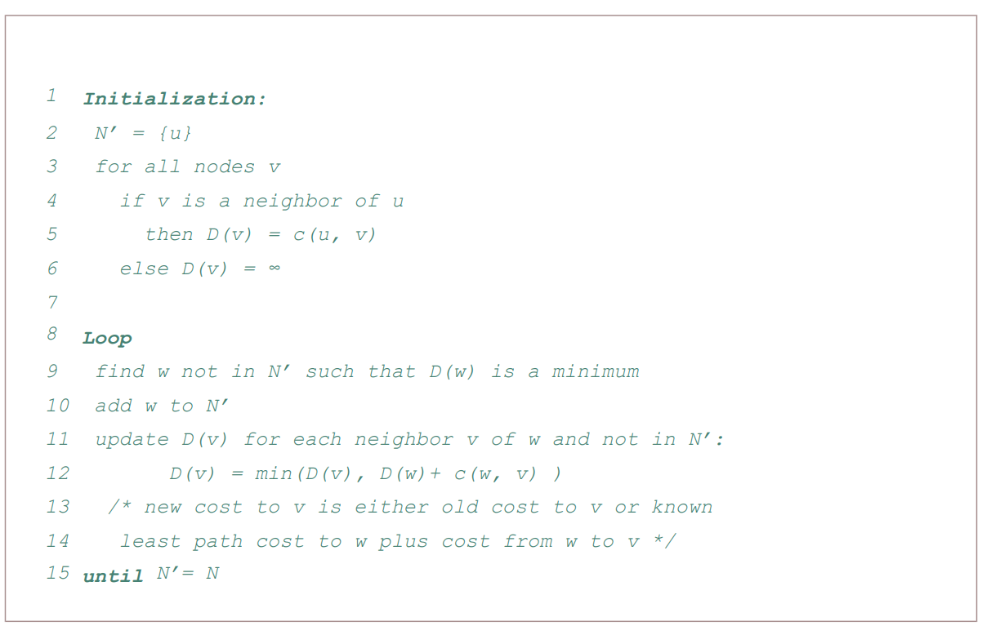
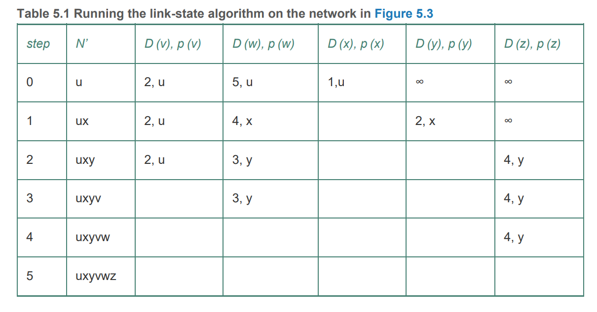
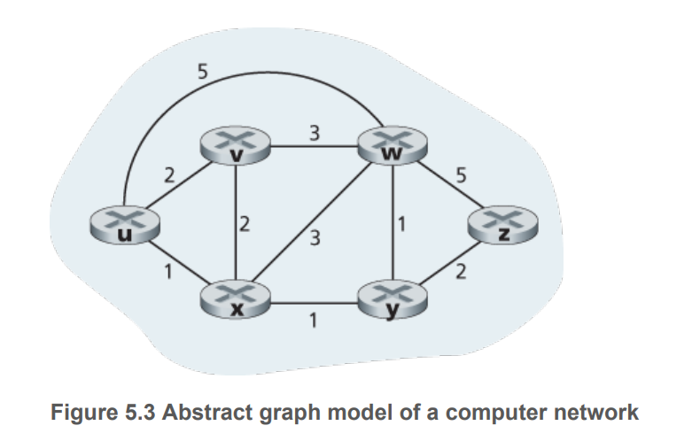
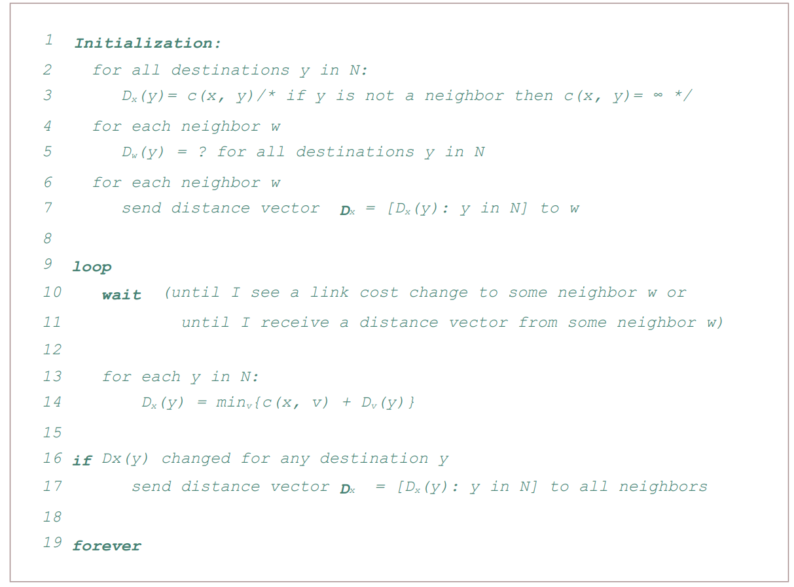

# Routing Algorithms 

How to classify routing algorithms:
- Based on how they are runL:
  - Centralised - run by a controller - Djikstra 
  - Decentralised -  run by each router - Distance vector 
- Based on whether they are static or dynamic
  - Static - routes change slowly over time
  - Dynamic - response to topology or link cost change 
- Based on load sensitivity
  - Link cost varies with link congestion 

## Linkstate Algorithm - Dijkstra

Network topology and all link costs are known. In practice, this is achieved by having each node broadcast link-state packets to all other nodes in the network, with each link-state packet containing the identities and costs of attached links - `link state broadcast` algorith. As a result, each node have an identical and complete view of the network. 

Terminologies: 
- `D(v)`: cost of least-cost path from source node to destination v at current iteration 
- `p(v)`: previous node neighbor of v along the current least cost path from source to v
- `N'`: subset of nodes: $v \in N'$ if the least cost path from source to v is known 
- `c(u,v)`: edge cost of edge `(u,v)`.

Complexity:  $O(n^2)$ for routing, $O(mn)$ for message exchange

## Distance Vector Algorithm 

DV algorithm is iterative, asynchronous, and distributed. 

Terminologies:

- $d_x(y)$: least cost of all paths from x to y: $d_x(y) = \min_{v \in \text{Adj(x)}}\{d_{v}(y) + c(x,v)\}$

## Distance vector with Poisoned Reverse 

If $z$ routes through $y$ to get to destination $x$, then $z$ will advertise to $y$ that its distance to $x$ is infinity.

# Comparing Linkstate and Distance vector

- Message complexity: LS requires an exchange process at cost $O(mn)$.
- Convergence: DV can converge slowly
- Robustness: in LS note calculation affects only its table. If a node boardcast incorrect costs for its link, it could affect the whole network under DV. 

# Scaling routing 

Described algorithms are impractical due to the following concerns: 

-`Scale`: as the number of routers increases, the overhead becomes large and storing information at one router is prohibitive. 

-`Administrative autonomy`: organisations want to be able to choose their routing algorithm.

The concerns are addressed by organising routers into autonomous systems or `ASs`

- `Intra-AS routing` - routing among hosts, routers within the same `AS`, using the same routing protocol. 
- `Inter-AS routing` - routing among different `AS`. 

The responsibility of routing is performed by `gateway routers`, which is located at edge of its own `AS` and has links to other `AS`. `Gateway routers` perform both intra-AS and inter-AS routing. 

