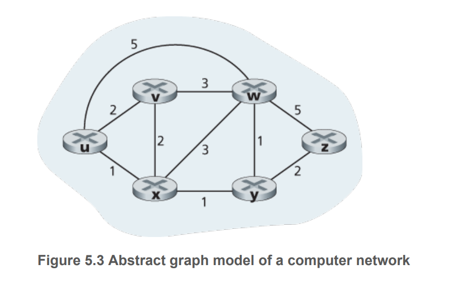

# Link state algorithm 

## 1. Describe the link state algorithm 

```
Initialisation 
root node r 
For node n in V:
    If n in r.neighbor:
        D(r) = c(r,n)
    else
        D(r) = inf 
Let S = {} 
Let Q = V - {r}

LinkState(r)
while Q is not empty:
    Pick v from Q with min D(v)
    Q = Q - {v}
    S = S + {v}
    for u in v.neighbour:
        D(u) = min(c(r,u), D(v) + c(u,v))
```

## 2. Apply linkstate algorithm on this map: 




## 3. Describe the oscillation issue with link state algorithm 

Let G = (V,E) be a directed graph where c(u,v) reflects the load from node u to v. After evaluating the routes at t=1, best path from y to w is CCw, best path from x to w is CCw. After evaluating the routes at t=2, best path from y to w is CW, from x to w is CW. This oscillation continues forever. 


## 4. What is a way to prevent oscillation: 

Nodes are to be updated synchronised at different times. 

## 5. What is the cost of Link State: 

Synchronise - send data to all nodes with init $O(|V||E|)$

Algorithm: $O(|V|^2)$

# Distance Vector Algorithm 

## 1. Describe Distance Vector Algorithm 

```
Initialise
For each node v in V:
    for each node u in V:
        if u in v.neighbor:
            Dv(u) = c(u,v)
        else:
            Dv(u) = inf 


DistanceVector(v):
while v receive a link cost change or receive a vector from neighbor: 
    for u in V:
        Dv(u) = min{Dv(w)+c(w,u): w in v.neighbour}
    If Dv changes
        send Dv to all neighbours


```

## 2. Describe problem with DV:

Count to infinity 

## 3. Describe Poison Reverse 

Sends inifinity to v for each best path from u that routes through v

## 4. One problem with routing protocols is that they can be subject to route oscillations. Would this happen in a routing protocol that used number of hops as its cost metric? Why or why not?

Yes if there are two paths with the same number of hops. Or if there is link failure. i.e. count to infinity -> not converging. 