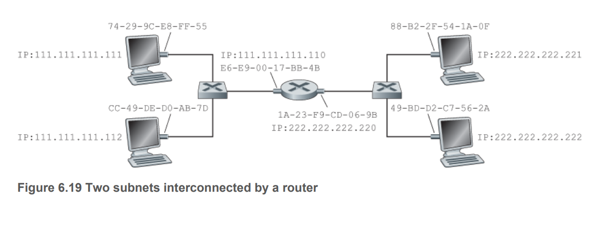

# Introduction to Link Layer

## Terminology:

- `Node`: device that run link layers: - end systems, routers, switches
- `Links`: communication channels that connect adjacent nodes
- `Frame`: datagram from network + header to be transported in link layer. 
  
## Services provided by the link layer 

- `Framing` - encapsulate datagram within link layer frame before transmission.
- `Link Access`: MAC protocol specifies the rules by which frames get transmitted. 
- `Reliable Delivery` - used for links prone to high error rates
- `Error detection and correction`

## Where is Link Layer Implemented 

Implemented in network adapter also known as network interface card. 
Functionalities are implemented in hardware. 

# Error Detection and Correction 

Terminology: 
    - `D`: payload data sent - unobserved
    - `EDC`: error detection code sent - unobserved
    - `D'`: payload data received - observed
    - `EDC'`: error detection code received - observed

Input:
    - `D'`
    - `EDC'`

Output: 
    - Whether `D'` was corrupted in transport 

## Parity Check

Sender: 

Suppose `D` has `d` bits, includes one additional bit such that the number of 1 in `d+1` bits is even. 

Receiver: 

- Count the number of 1 in `D'` and `EDC'`. If the number of 1 is odd in an `even parity scheme` -> Error detected. 
- Issue: if there is an even number of bit errors, fail to detect. 
- In many cases, errors occur in burst and with bit error rate of up to 50%. 

## Generalisation of bit parity check that allows for correction 

- `d` bits arranged into i rows and j columns. 
- A parity value is computed for each row and column -> the EDC has i + j + 1 bits 
- Can be used to detect and correct error bit. 

## Checksum 

Sender: 
- `d` bits are treated as a sequence of `k` bits integers 
- Sum the k bits and use the 1s complement as the error detection bits. 

Receiver:
- Take 1s complement of the sum of `D'` and `EDC'`. 
- The result should be all 1 
- If any 0 occurs, an error is indicated. 

In TCP and UDP: 
- Checksum over all headers and data 

In IP:
- Checksum over headers

## Cyclic Redundancy Check 

- Sender and receiver must first agree on `r+1` bit pattern called the generator `G`.
- `G`'s MSB is 1.
- Note that the largest bit error to be detected is `r`, hence G has size r + 1.  
- For every `D`, sender will choose `r` additional bits `R` and append to `D` such that the resulting bit pattern length `r+d` is divisible by `G` under mod 2. 

Receiver: 
- Divides the `r+d` bits by `G`. If the remainder is nonzero, error is detected. 

**Note** CRC calculations are done in mod 2 without carries in addition or borrow in substraction. Hence Addition and Subtraction are equal to XOR. 

How to find `R`: 

We want to find `R` such that there is an `n` such that 

$$(D\times 2^r) \text{XOR} R = nG $$

i.e choose `R` such that the `d+r` bit is divisible by `G`.

If we XOR R to both sides, we have: 

$$D \times 2^r = nG \text{XOR} R $$

If we divide $D\times 2^r$ by $G$, the remainder is `R`. 

$$R = rem \frac{D\times2^r}{G} $$

## Why Checksum in Transport layer and Cyclic redundancy is Linklayer 
- Transport layer error detection is done by software -> Cannot perform too complex operations due to overhead 
- Link layer error detection is done by hardware -> Specialised hardware can perform more complex operations. 

# Multiple Access Link and Protocols

- `Point to Point`: single sender and single receiver of link 
- `Broadcast Link`: multiple sending and receiving nodes to the same single shared broadcast channel. When any node transmits a frame, the channel broadcasts the frame and each of the other nodes receives a copy. - e.g. Ethernet and WLAN

Problem: 
- How to coordinate the access of multiple sending and receiving nodes to shared broadcast channel - the `multiple access problem`. 

Protocol classification:
- `Channel partitioning`
- `Random Access`
- `Taking turns`

Desirable characteristics:

- When only one node is transmitting, throughput of node is R.
- When M node is transmitting, each node has an ideal throughput of R/M.
- Decentralised. 
- Inexpensive to implement

## Channel Partitioning Protocols 

- TDM eliminates collision and is fair. The drawback is if a node is the only one transmitting, its throughput is R/N. Another drawback is it must wait for its turn (wait for allocated frame).

- FDM also eliminates collision and is fair, but bandwidth is limited to allocated frequency. 

- Code division multiple access (CDMA): 
    - assigns a different code to different nodes. 
    - each node uses the code to encode its data bit 
    - different nodes can transmit simultaneously and have their data received correctly in receving channel. 

## Random Access Protocols 

A transmitting node always transmits at full capacity. When a collision occurs, each node repeatedly retransmits its frame until the frame experiences no collision. However, it must wait for some timeout before it can send. 

### Slotted ALOHA Protocol 

Assumptions:
- Every frame has L bits 
- Time is divided into slots of size L/R
- Node starts to transmit frames only at the beginning of slot
- Each node knows when the slots begin 
- If two or more frame collide in a slot, then all nodes detect the collision event before the slot ends. 

Operation
- When a node has something to send, it waits until the beginning of the next slot and transmit the entire frame in one slot. 
- If there is a collision, the node retransmits its frame in each subsequent slot with probability p until the frame is transmitted without collision. 

Advantages:
- Full utilisation 
- Decentralised 
- Simple

Disadvantage:
- When colliion occurs, the collision timeslot is wasted
- When two nodes decide to retransmit, there can be timeslot that are unused 

Definition:
- Useful slot - slots in which only one node transmit 
- Efficiency - fraction of slots that are useful 

We can show - i.e model with Binomial Distribution that the efficiency is 
$$P(X=1) = Np(1-p)^{N-1} $$

When N approaches infinity, this becomes 0.37. 

### ALOHA Protocol

Works in a similar way except that now it does not need synchronisation. Efficiency is reduced by half.

### Carrier Sense Multiple Access (CSMA)

- Carrier Sensing: a node listens to the channel before transmitting.  
- Collision Detection: if it detects another transmission in process, it waits until channel is free.

**Note** collision may still occur due to propagation delay - i.e. if a node is in a process of propagation, other nodes may detect that the channel is free - i.e. the bit being propagating has not reached the sensing node. The larger the propagation delay, the higher the chance of missed detection. 

### Carrier Sense Multiple Access with Collision Detection (CSMA/CD)

Figure 6.13 is CSMA with detection. If the adapter detects collusion, it aborts the transmission and wait a random amount of time before retransmitting. 

The backoff period is determined based on `binary exponential backoff` algorithm. When transmitting a frame that has already experienced n collusions, a node chooses K at random from 0 to 2n-1. The more collisions, the wider the backoff window. The efficiency is: 

$$\frac{1}{1+5\frac{d_{prop}}{d_{trans}}}$$

When propagation time is small or transmission time is big, the efficiency approaches 1. 

## Taking-turn Protocols 

- Pooling protocol:
    - One node designated as a master node 
    - Master node polls each node in a round-robin fashion, and tell each node how many frames it can send. 
    - e.g. tell 1 to send x frames. After 1 finishes, tell 2 to send y frames, etc.

Eliminates collision and empty slots (when only 1 is speaking, not the full bandwidth is utilised). Drawback is polling delay and central node requirement (if the master node fails, the whole system is broken).

- Token-passing Protocol 
    - A special purpose frame `token` is passed around 
    - When a token is passed to a node, it holds onto the token if it has something to transmit. Otherwise it forwards to the next node. 
    - If a node has something to transmit, it transmits up to a limit amount of frames. 

Decentralised and efficient, but if one node fails, the whole system may fail. If the node fails to send the token to other, some mechanisms are required to retrieve the token. 

# Switched LAN 

Switch is the equivalent of router but for link layer connection. 

## Link Layer Addressing 

- Hosts and routers with multiple network interfaces will have multiple link layer addresses and multiple IP addresses associated with each interface. 
- However link layer switches do not have link layer addresses with their interfaces. 
- Hosts and routers do not need to specify switches interface the datagram needs to go through, just the source and destination LAN addresses (`MAC Addresses`)
- MAC addresses are 48 bit long divide into 6 groups 8 bytes long. No two adapters have the same MAC addresesses. The address space is managed bny IEEE. 
- A MAC address structure is flat and doesn't change when it moves. This is unlike IP addresses, which changes depending on the network it connects to. 
- When an adapter sends a frame to a destination, it inserst the destination MAC address to the frame and sends to LAN. 
- An adapter may receive a frame that is not addressed to it due to broadcasting. 
- If the MAC address in the frame match with the receiving adapter's, it extract the datagram and pass to network layer, otherwise discard. 
- If an adapter wants all other adapters to receive and process a special frame, it uses a special MAC broadcast address - i.e. FF-FF-FF-FF.

## Address Resolution Protocol 

ARP is for mapping the MAC address and IP address 

- Each host and router interface has an ARP table containing mappings of IP addresses to MAC addresses. (the router in 6.19 has 2 interfaces and thus 2 ARP tables)
- If the sender ARP doesn't have the MAC address of the receiver, it sends a special packet called ARP packet to query all other hosts  and routers on the subnet toe determine the MAC address corresponding to the IP address being resolved. The ARP packet is broadcast to all nodes on the subnet. 
- The ARP packet has sending and receiving IP and MAC address.
- For query, the receiving MAC address is the broadcast MAC address - FF-FF-FF-FF-FF-FF.
- Upon receiving the ARP response, the sending node updates its ARP table. 
- The query is sent in a broadcast frame
- The response is sent in a standard frame. 
- ARP table gets built automatically and eventually deletes a node if that node is no longer available (due to TTL)
- Very similar to DNS, except that DNS resolves hostname for every host on the Internet, while ARP resolves IP addresses only for hosts and routers on the same subnet. 

## ARP Sending Datagram Off the Subnet 

Assume 111.111.111.111 wants to send a datagram tp 222.222.222.222

- 111.111.111.111 sends a frame to the router with interface 111.111.111.110 with MAC address determined by ARP 
- Router receives the frame, notice that the MAC address is addressed to it and extract the datagram from received frame.
- Router determines which outgoing interface to use via forwarding table - 222.222.222.220
- Router envelops the datagram in a frame addressing 222.222.222.222/
- Router from interface 222.222.222.220 sends the datagram to 222.222.222.222 with MAC address determined by ARP. 

# Switch 

## Topology

Performs: 

- Filtering: whether to forward or drop a frame 
- Forwarding: determine which interface to formward to 

Switch table is generally similar to a forwarding table for network layer router: 

## What happen when a frame arrives at a switch 

- If the destination address is in the switch table but interface is not the same as the adapter: forward the frame to the target interface. 
- If the destination address is the same as the interface that the adapter receives the frame: discard the frame as the frame is a broadcast
- If the destination address is not in the switch table - the switch forward copies of the frame to all interfaces - perform broadcasting 

## Switch self-learning 

Switch table is built automatically, dynamically and autonomously - i.e self-learning. 

- Switch table is initially empty 
- For each incoming frame received on an interface, the switch stores 
  - the source's MAC address, 
  - the receiving interface,
  - current time 
- If every host sends a frame, every host will be recorded. 
- The switch deletes an address if no frames are received with that address as the source after some time window.

Why does this work? 
- The interface for each address entry is the interface that the switch receives frames from and forwards frames to. 
- When a frame arrives at a switch interface, it records the entry and hence knows which interface to forward to when a frame addressing this address arives. 

## Properties of Link-Layer Switching 

- Eliminate collisions: no wasted bandwidth due to collision. Switches buffer frames and never transmit more than one frame on any segment at any time. Significant performance over LAN with broadcast links. 
- Heterogenous links: switch isolates one link from another, different links can have different speed and run on different media. 
- Management: eases network management - if an adapter malfunctions and continually sends Ethernet frames, switch can detect and disconnect the malfunctioning adapter. 

## Switches versus routers 

Difference in that it forwards packets using MAC addreses. Layer 3 (router) vs Layer 2 switch. 

Pros of Switches: 
- Plug and Play - no need for network admin to do anything 
- High filtering and forwarding rates 

Cons:
- Topology is restricted to a spanning tree 
- Large switched network requires large ARP hence large ARP traffic and processing 
- Broadcast storm - one host goes haywire and transmits endless Ethernet broadcast frames -> collapse the network 

Pros of Routers: 
- IP addresses are hierrachical -> Packets do not normally cycle through routers when there are redundant paths. 
- Is not restricted to a spanning tree and have a best path topology.
- Firewall protection against broadcast storm.s. 

Cons: 
- Not plug and play, need to configure. 
- Larger per packet processing time. 

# Link virtualisation - network as link layer 

MPLS - packet switched virtual circuit network. It has its own packet formats and forwarding behaviors - link layer technology that interconnects IP devices. MPLS directs data from one network node to the next based on short path labels rather than long network addresses, avoiding complex lookups in a routing table.

Each packet entering an MPLS network is labeled with a locally significant MPLS label. As the packet passes through the MPLS network, label is replaced with another label or stripped off. The network distributes information so that each switch knows what it is supposed to do if it encounters a particular label by simply looking up the MPLS table. Thus, the router functionality is reduced to switch functionality, speeding up the data transfer significantly.

## Multiprotocol Label Switching 

MPLS link layer frame is handled by an MPLS capable router. MPLS added fixed length label between Ethernet header and IP header. 

IP address matching is done only once, when a packet enters an MPLS domain.

The subsequent MPLS capable routere do not look up the destination IP address. They look up the longest prefix match in the forwarding table. 

## MPLS example: 

- R1 through R4 are MPLS capable,
- R5, R6 are standard IP routers 
- R1 advertises to R3 and R4 that it can route packets with label 6 to destination A 
- R3 advertises to R4 that it can route packets labelled 10 to A and label 12 to D
- R2 advertises to R4 that it can route labelled 8 to A

R4 now has two paths to A - via interface 0 with label 10 or interface 1 with label 8. 

MPLS performs switching based on labels without the need to consider the IP address of a packet. Router's path is computed on a per router basis - i.e. routers need to extract IP headers to perform forwarding, whereas the path is precomputed based on MPLS label. 

True benefit lies in traffic management capabilities. IP routing would only yield one single least cost path. MPLS provides the ability to forward packets along routes that would not be possible using standard routing IP protocols - i.e. 
- Reroute traffic over a precomputed failover path in link failure
- Implement VPNs 