### 1. Given that $\lim_{N\rightarrow \infty}(1-\frac{1}{N})^N=\frac{1}{e}$, find maximum efficiency of Slotted ALOHA:

Assume there are $N$ transmitting nodes, each transmitting with a probability of $p$ when a collision is detected. Let $X$ be a random variable denoting the number of nodes transmitting in the same time slot. $X \sim B(N,p)$. Hence efficiency is defined as the probability that there is only 1 transmitting node for  a timeslot: 

$$E = P(X=1) = Np(1-p)^{N-1}$$

To derive optimal efficiency with respect to $p$ take the derivative w.r.t $p$:

\begin{align*}
\frac{dE}{dp}&= N(1-p)^{N-1} - N(N-1)p(1-p)^{N-2} \\
&=N(1-p)^{N-2}(1-p-Np+p) \\ 
&=N(1-p)^{N-2}(1-Np)\\
&=0
\end{align*}

This is achieved when $p=1/N$ (p cannot be 1 otherwise collision will always occur). Take the limit w.r.t N:

$$
\begin{align*}
\lim_{\rightarrow \infty} Np^*(1-p^*)^{N-1} &= \lim_{N\rightarrow \infty} \left(1 -\frac{1}{N}\right)^{N-1} \\
&=\lim_{N\rightarrow \infty} \left(1 -\frac{1}{N}\right)^{N} /\left(1 -\frac{1}{N}\right)\\
&=\lim_{N\rightarrow \infty} \left(1 -\frac{1}{N}\right)^{N} /\lim_{N\rightarrow \infty} \left(1 -\frac{1}{N}\right) \\
&= 1/e/1 = 1/e
\end{align*}
$$

### 2. Find the maximum efficiency of ALOHA: 

For ALOHA, the nodes are not synched - i.e. there is no time slot and each node does not know if there is a propagation in process. Hence a useful slot is defined as follows: 

- All other nodes do not begin a transmission when one node is transmitting: probabilty of this happening is $(1-p)^{N-1}$
- There is not a transmission that is already in progress when a node is transmitting: probability of this happening is also $p(1-p)^{N-1}$

Hence for a node, the probability of a successful transmission is $p(1-p)^{2(N-1)}$. For N nodes, this is equivalent to $Np(1-p)^{2(N-1)}$. Thus maximum efficiency of ALOHA is $1/2e$

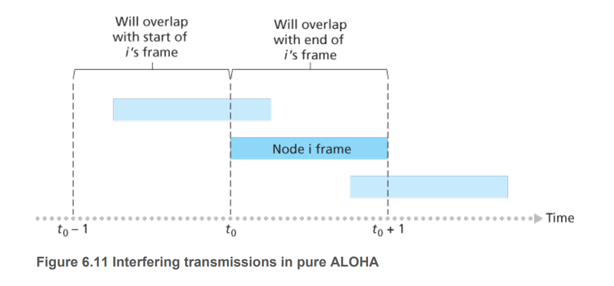

### 3. Explain the protocol for CSMA: 

A node listen to the channel before transmitting. If the channel is free, the node transmit with full bandwidth. If the channel is busy, it waits until it detects no transmission. If a transmitting node detects that another node is also transmitting, it waits a random amount of time before repeating the sense and transmit cycle. 

### 4. How do collisions occur in CSMA 

Due to propagation time. When a transmission is already in progress, but the transmitted bits have not reached the node with data to send, this node cannot sense that the channel is busy and may begin transmitting its data which causes a collision. 

### 5. How is the wait time determined for CSMA/CD
When transmitting a frame that already experiences $n$ collision, a random waiting value $K$ is chosen from $\{0,1,\dots,2^{n-1}\}$. For Ethernet, need to wait $K\times512$ bit times (i.e. K times the amount of time needed to transmit 512 bits to the Ethernet). Maximum n is capped at 10. 

### 6. What is the maximum length of time the adapter will wait until the next transmission attempt given 7 collision has occured. Assume that you have a 10 Mbps broadcast channel?

In CSMA/CD, a transmitter waits K multipled by the transmission time of 512 bits, the transmission time is: 

$d_{t} = \frac{L}{R}=\frac{512}{1000 \times 10^3}=0.512$ms 

Given 7 collisions, max K is $2^6 = 64$. Hence max wait time is $64\times 0.512=32.768$ms 

### 7. Explain the ARP protocol

The ARP protocol is used to provide a mapping between network layer IP address and link layer MAC address. 
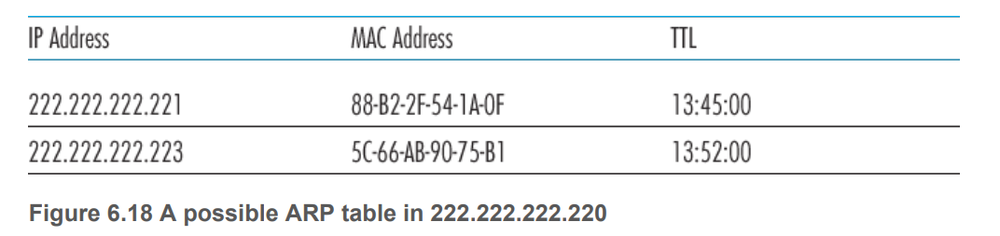

### 8. Why is an ARP query sent with a broadcast frame? Why is an ARP response sent with a normal frame (unicast)?

An ARP query is needed when a node needs to send a datagram that is IP addressed to another node. However, it does not have the IP mapping entry in its ARP table. Since the destination MAC address is not known (it is the object of the query), the node must ask all nodes within its subnet (broadcast to all nodes). A response need not to be a broadcast because it is a reply to a querying node, whose MAC address is known. 

### 9. Explain the ARP query process 
If a host needs to send a datagram that is IP addressed to another host, but it does not have the MAC address of this host in its ARP table, it will 
- encapsulate the datagram inside a link-layer frame with source IP, source MAC address, dest IP filled. The destination MAC address is set to be the broadcast address and this frame is broadcast to all nodes in the subnet.
- Other nodes in the subnet receives the frame and check whether its IP is the same as the destination IP.
- The node with a matching IP address will send an ARP reply (uni-cast) addressing the sending host. 
- Sending host caches the response until information becomes old. 

### 10. Explain how a frame is transmitted within a subnet 

- A sending host needs to send an IP addressed datagram to another host (dest IP is known).
- The host passes the datagram to its adapter.
- The adapter looks up the ARP table to find destination MAC address
- It encapsulates the IP datagram in link-layer frame with source IP, source MAC address, dest IP, dest MAC address
- It sends the frame to the Ethernet. 

### 11. Explain how a frame is transmitted between two subnets

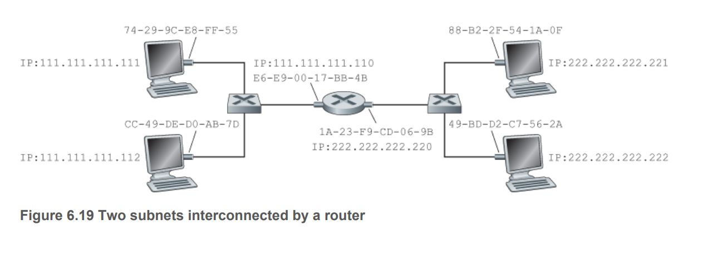

Assuming host 111.111.111.111 wants to send an IP packet to host 222.222.222.222

- It first passes its message to its adapter
- Adapter encapsulates the message with the MAC address of the router interface in its subnet, with the IP address of the target IP address. 
- The router adapter receives the frame, seeing that the frame is addressing its from the destination MAC address. 
- The router extracts the IP datagram and determines the outgoing interface from the destination IP address based on forwarding table. 
- The router's adapter in the subnet of the receiving host creates another frame enveloping the IP datagram with MAC address the MAC address of the receiving host's adapter and send to the host. 

### 12. What is included in an Ethernet frame structure

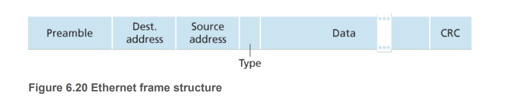

### 13. How does a switch performs forwarding and filtering: 

A switch has a switch table that maps MAC addresses to interface that frames from this address are received from or to be forwarded to. Take a scenario when a switch receives a frame from an interface $x$, with source address $A$ and destination address $B$. 

- If the interface matching B in its switch table matches $x$: this is a broadcast message and the frame is to be dropped. 
- If the interface matching B in the table is $y$ not $x$: forward the message to the link at interface $y$
- If the sending MAC address is not in the table, it will be added to the table with entry $A:x$
- If the destination MAC address is not in the table, the frame is broadcast to every node in the subnet (except for A). 

### 14. Explain self-learning property of a switch 

A switch is a plug and play device - that is a network administrator does not need to set it up. It does so via self-learning. When a new switch receives a frame from a host with MAC address A, arriving at interface $x$:

- It records A,x and time in the switch table.
- It broadcasts the message since it doesn't know who to send to 
- It deletes an address in the table if no frames addressing A is received within a time window. 

### 15. Pros and Cons of Switch over Router

Pros:
- Little overhead in encapsulation, simple header, hence quicker processing time 
- Plug and play - no need for set up 
  
Cons:
- Broadcast storm - a node continuously broadcast ethernet frames to other nodes in the subnet, leading to eventual collapse. 
- Must use a spanning tree structure to connect the adapters. 
- In large subnets, a lot of time due to switch table indexing (large table), also huge ARP traffic. 

### 16. Pros and Cons of Router over Switch 

Pros: 
- Can have minimum path optimal structure 
- Firewall to prevent broadcast storm 
- Generalised forwarding - match + action (broadcast, changing header, dropping packets etc)

Cons: 
- A bit slower due to the need to extract more information (up to layer 3 information)
- Need to be setup. 

### 17. What is meant for the switch to be transparent

Sending and receiving nodes must creating frames addressing each other without knowing the existence of a switch

### 18. Explain how MPLS works

MPLS adds MPLS header to a packet and can therefore only be processed by MPLS compatible router. The purpose of MPLS is to not have to reply on extracting the IP datagram and compute router's operation for each router. The best path is predetermined known as least switched path (LSP). When an IP datagram enters an LSP, an ingress node adds a label header to it, then pass it to the corresponding interface to transfer to the next adapter. The adapter looks at the label and forwards it along the LSP until the egress router, at which case the IP datagram is extracted. The IP header of a packet is only processed at the ingress node, and not at any other nodes in the LSP. 

### 19. Advantages of MPLS 

- Faster processing because a node does not need to perform forwarding table lookup by performing longest prefix match. The processing is performed on short fixed length label that is only relevant within the MPLS network. 
- Traffic engineering - there can be multiple paths instead of best path in IP.
- Allows for failover route redirection and establishment. 

### 20. Explain how full-duplex mode in a LAN can reduce collisions to zero: 

Separte sending and receiving cable, hence collision is zero. 

### 21. Why do we carry out error detection and/or correction at Layer 2, given that it is carried out at Layers 3 and 4 as well?

- The designs of each layer are independent - i.e. one layer cannot rely on other layers to perform some functions. 
- Checksum at higher level accounts for error at higher levels, not doing that would assume the processing from the channel up is 100% error free (defense in depth)
- Can perform more complex error detection/correction since operation is performed by hardware instead of software. 

### 22. Why switch only uses Spanning Tree? 

When there is more than 1 layer 2 path between two hosts, the loops creates broadcast storms as broadcasts and multicasts are forwarded by switches to every port. The switch will therefore repeatedly rebroad cast messages flooding the network. Since the layer 2 header does not have a TTL field, is a frame is sent to looped topology, it can go on forever. 

### 23. Why is CRC used at Layer 2 and Checksum used at Layer 3? 

Layer 2 error detection is perform by hardware hence can perform more complex operations 

### 24. Explain the steps for Even Bit Parity detection:

Count the number of 1s in data D. Set the Partity bit so that the total number of 1s is even. 

### 25. Explain the steps for Even Bit Parity 2d: 

Data is split over i rows and j columns. Parity bits will be i + j + 1 long. Perform parity bit encoding along the rows and columns and do the same thing for the final result. 

### 26. Explain how checksum works: 

- Split D to sequences of K bits 
- Sum all bits with carry bit wrap around 
- Get 1s complement - flip binary 
- The result is in checksum field. 

### 27. Explain how Cyclic Redundancy Check is used: 

- Agree on G of length r + 1. This means the CRC will detect burt error less than r bits 
- Find R of length r such that the resulting D x 2^r + R is divisible by G. 
- R is set as the remainder of D x 2^r /G
- Send data with D in data field and R in CRC field: 

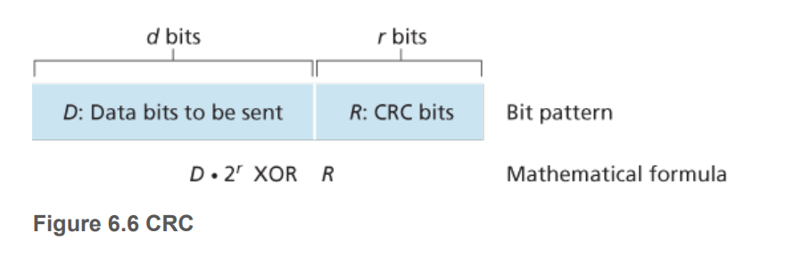

### 28. Purpose and process of error detection and correction 

Error detection and correction techniques allow the receiver to sometimes but not always detect bit errors that have occured. Even with error detection bits, there can still be undetected bit errors. Goal is to have error detection scheme that reduces the probability of this happening. We can have more accurate error detection scheme but that will incur a much higher overhead. 

### 29. If all the links in the Internet were to provide reliable delivery service, would the TCP reliable delivery service be redundant? Why or why not?

Yes, the data may appear not in order. 

### 30. What are some of the possible services that a link-layer protocol can offer to the network layer? Which of these link-layer services have corresponding services in IP? In TCP?

- Framing: same as multiplexing 
- Forwarding - same as IP 
- Error Checking - same as IP and TCP 
- Reliable data delivery - same as TCP 

### 31. Suppose two nodes start to transmit at the same time a packet of length L over a broadcast channel of rate R. If transmission delay is less than propagation delay, will there be a collision ? Why or why not

Yes because it will start receiving data while transmitting its own

### 32.  In CSMA/CD, after the fifth collision, what is the probability that a node chooses K = 4? The result corresponds to a delay of how many seconds on a 10 Mbps Ethernet?

Delay space: $[0, 16]$, hence probability is 1/17.

Transmission time: $L/R = 512/10^6=0.512$ms. Delay: 0.002048 s

### 33. Why would the token-ring protocol be inefficient if a LAN had a very large perimeter?

When a node transmits a frame, it has to wait for the frame to propagate through the entire ring before it can release the token. If L/R is small compared to propagation time, the protocol will be inefficient.

## 34. How big is the MAC address space? The IPv4 address space? The IPv6 address space?

2^48, 2^32, 2^128

## 35.  Suppose nodes A, B, and C each attach to the same broadcast LAN (through their adapters). If A sends thousands of IP datagrams to B with each encapsulating frame addressed to the MAC address of B, will C’s adapter process these frames? If so, will C’s adapter pass the IP datagrams in these frames to the network layer C? How would your answers change if A sends frames with the MAC broadcast address?

If the MAC address does not address C, C still process the frame but will not pass the datagram to the next layer. If it is a broadcast, the frame will be processed and datagram passed to the next layer. 

## 36. How many subnets are in this diagram

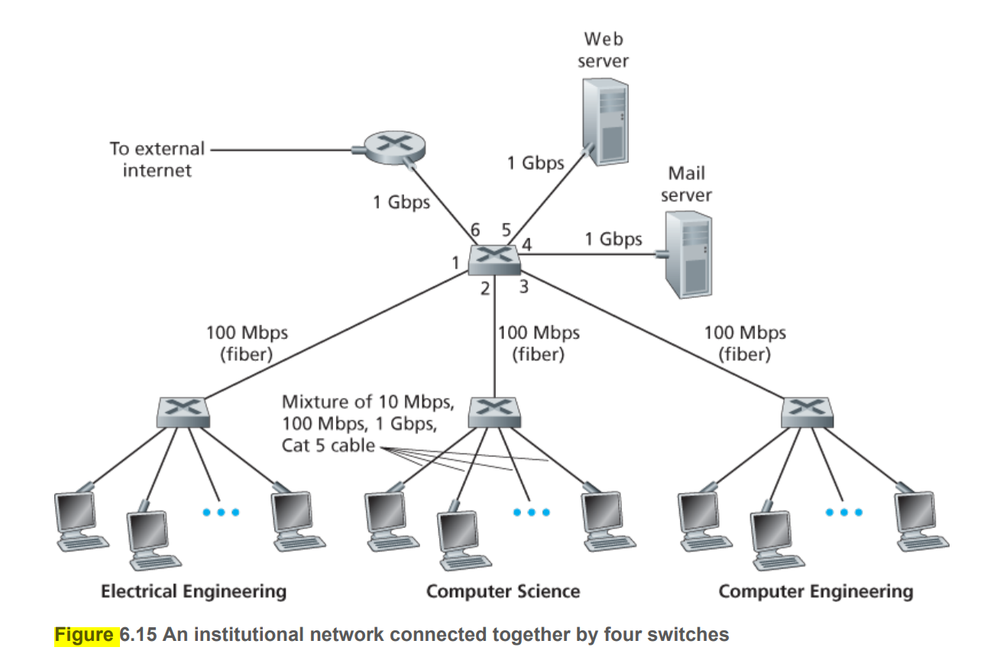

2 - internal subnet and the external internet

## 37. Consider the 5-bit generator G = 10011, and suppose that D has the value 1010101010. What is the value of R?

0100

## 38. Consider the previous problem but D has value a: 1001010101, b: 0101101010, c: 1010100000

0000, 1111, 1001

## 39. Answer this question: 

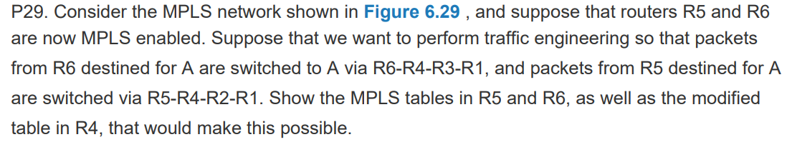

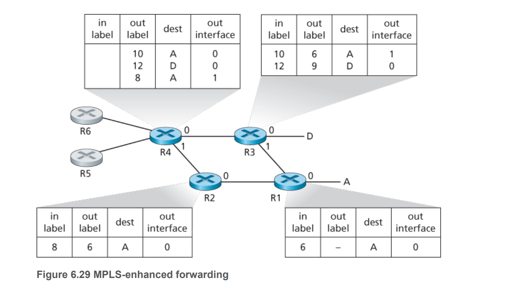

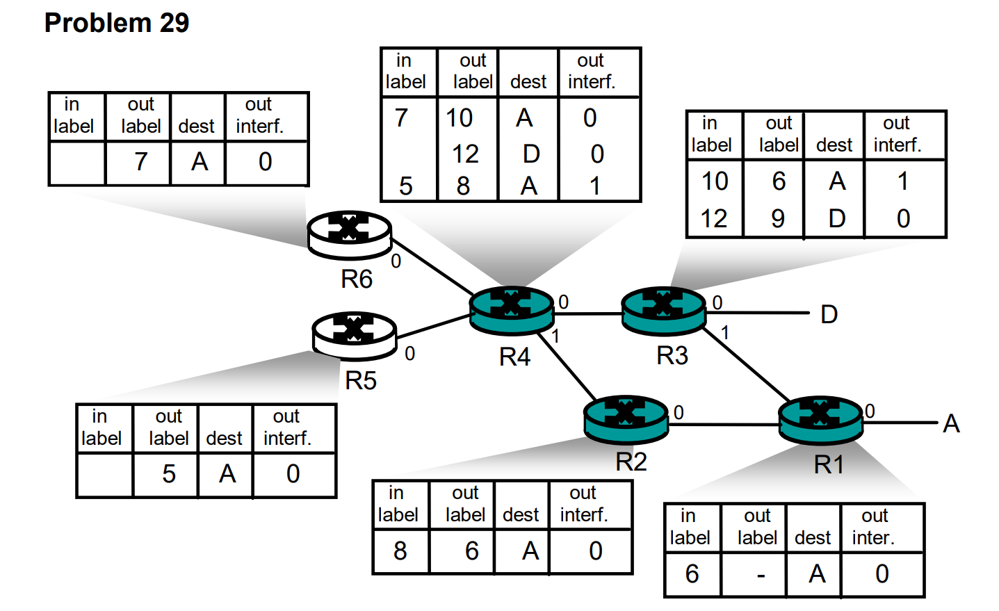

## 40. Answer this question

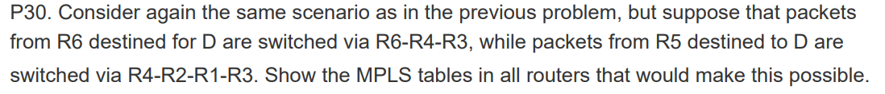

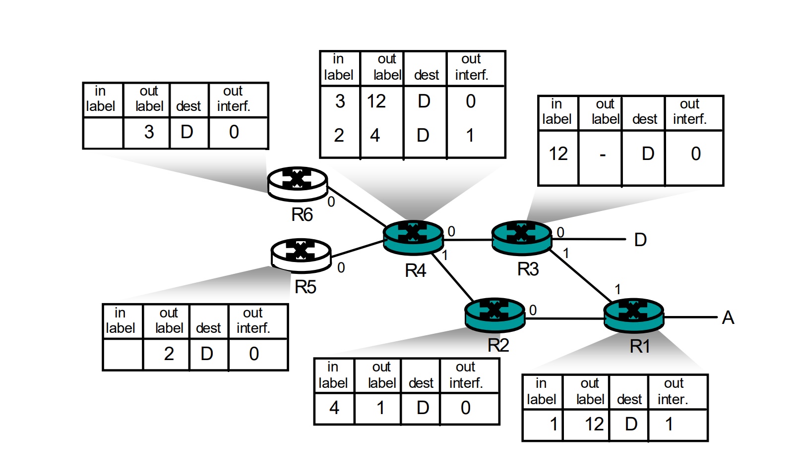