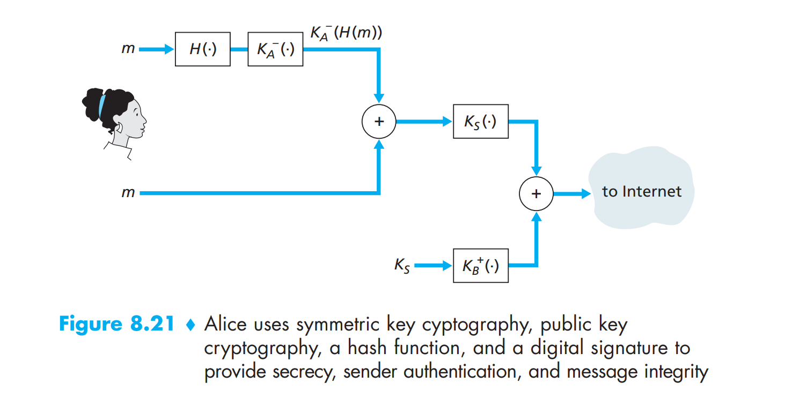

## 1. What is eavesdropping? 

Intercept message 

## 2. What is spoofing:

Fake source address in packet 

## 3. What is Hijacking

Taking over connection by removing sender or receiver, inserting hacker in place 

## 4. What is denial of service 

Prevent service from being used. 

## 5. What is packet sniffing 

Promiscuous network adapter reads all packets 

## 6. What are the aims of network security 

- Confidentiality: message only known by sender and receiver 
- Integrity: message not tempered with by 3rd party 
- Authentication: sender and receiver being able to verify the other party
- Access and Availability: service must be accessible and avialble

## 7. What is symmetric key cryptography 

Sender and Receiver have a shared key $K_s$ (symmetric) that can be used to encrypt and decrypt messages. i.e. given plaintext: $m$, encrypted message is $K_s(m)$, decrypted message is $K_s(K_s(m))=m$

## 8. What is the issue with symmetric key cryptography

Sender and receiver need to communicate to come up with the shared key. Shared key cannot be public.

## 9. What is public key cryptography

Receiver has a public key $K_B^+$ and a private key $K_B^-$. Sender uses $K_B^+$ to encrypt the message which can only be decrypted using $K_B^-$

## 10. What is the disadvantage of using public key cryptography: 

Inefficient for long message 

## 11. How is public key cryptography used practically?

Sender comes up with a session key and encrypted using receiver public key. Receiver acquires session key by decrypte it using private key. Subsequent messages are encrypted and decrypted using the shared session key. 

## 12. For authentication, how to avoid record and playback attack

Use a nonce - a number that is used only once for authentication. A to send an authentication request, B to send a nonce, A to send back an encrypted nonce with shared secret key. B decrypts and verifies the nonce. 

## 13. What is a digital signature 

Signature to verify an entity. Non-forgable. 

## 14. What is the digital signing process: 

Suppose A wants to verify B identity. B sends A a message encrypted using B private key and the original message $(m, K_B^-(m))$. A then uses B's public key to retrieve the message: $m' = K_B^+(K_B^-(m))$. If $m' = m$ then A verifies B identity.

## 15. What is the problem with digital signature using the entire message? 

Computationally expensive. Uses message digest with $H(m)$. B sends A: $(m, K_B^-(H(m)))$. A recovers the message digest and compare against $H(m)$. This allows A to verify message integrity and authentication at the same time. 

## 16. What is the purpose of having a certification authority? 

Map public key to entity.

## 17. Describe the process of using CA for sender and receiver. 

Receiver public key is CA signed by having the key encrypted using CA's private key.

Sender uses the CA signed public key together with CA's public key to acquire sender's public key. 

## 18. Draw the diagram for secure email server: 

## 18. What is the key distribution problem and how to solve this problem in an insecure network?

When using shared key, sender and receiver must communicate. The key could therefore be lost in transit or intercepted by a 3rd party. Uses public key cryptography in which there is a shared key and a private key. Practically, could be achieved by encrypting the shared key and decrypting using private key. 

## 19. Explain security hole unaddressed with a nonce: 

## 20. Explain playback attack 

## 21. Suppose N people want to communicate with each of N-1 other people using symmetric key encryption. All communication between any two people, i and j, is visible to all other people in this group of N, and no other person in this group should be able to decode their communication. How many keys are required in the system as a whole? Now suppose that public key encryption is used. How many keys are required in this case?

For symmetric key,

Each person needs to talk to N - 1 other people, hence requiring N - 1 keys 
There are N/2 pairs, hence there are N(N-1)/2 unique keys needed.

For asymmmetric key, 

Each person has a public and private set of keys, hence 2 per person and 2N for the system. 

## 22. How does traceroute uses ICMP 

Traceroute sends a series of IP datagrams each carrying a UDP segment. The nth datagram has TTL of n. The source keeps track of timer for each datagram. When the nth segment arrives at the nth host, it sends back an ICMP packet to the source, whicch contains the name of router and its IP address. When the ICMP message arrives, the source obtains the RTT from the timer and name and IP address of the nth router. 

## 23. What are the differences between message confidentiality and message integrity? Can you have confidentiality without integrity? Can you have integrity without confidentiality? Justify your answer

Confidentiality - only sender and receiver know the message 
Integrity - message not tampered with by third party 

They are independent, so you can have none, either, or both. e.g. attacker can modify encrypted message in transit without knowing the content. Or can read the message without altering it. 

## 24. From a service perspective, what is an important difference between a symmetric-key system and a public-key system

Symmetric: only the sender and receiver have the shared key. Public key - one key is know to public, another only the receiver knows 

## 25. In what way does a hash provide a better message integrity check than a checksum (such as the Internet checksum)?

With hashing, $x = y \iff H(x) = H(y)$. For checksum, there can be two different input with the same result.

## 26. Can you “decrypt” a hash of a message to get the original message? Explain your answer.

No, Unidirectional 

## 27. What does it mean for a signed document to be verifiable and nonforgeable?

Upon receiving a message signed by an entity, receiver can be certain that the message is sent by that entity. Non forgable means no one aside from the entity can have that digital signature. 

## 28. In what way does the public-key encrypted message hash provide a better digital signature than the public-key encrypted message?

Hashing provides a fixed length string that could be encrypted must more efficiently while serving the purpose of authenticating sender. 

## 29. Suppose certifier.com creates a certificate for foo.com. Typically, the entire certificate would be encrypted with certifier.com’s public key. True or false?

False, should be using private key 

## 30. What is the purpose of a nonce in an end-point authentication protocol?

Prevent record and playback attack 

## 31. What does it mean to say that a nonce is a once-in-a-lifetime value? In whose lifetime?

Nonce can be used to authenticate an entity in only one single communication session. The same nonce cannot be used to authenticate ever again. 

# 32. Compute Checksum of the 3 numebers 49 4F 55 31, 30 30 2E 39, 39 42 4F, 42

